demonstrate a knowledge of a range of specialised topics in information technology including historical, cultural, social, legal and ethical issues inherent in research applicable to the discipline of information technology
plan, conduct and manage an independent research project
evaluate and select research methodologies appropriate to information technology, and demonstrate their uses and limitations
critically analyse research literature
analyse, synthesise and evaluate factors in your research project
document and communicate research results, and the methods used, orally and in a written report
undertake independent learning and apply analytical thinking


# Introduction
```
3D printing
  layer-by-layer: 
    1. time-consuming; 
    2. support structure, waste material, difficult to remove
  -> motivate: freeform printing, wireframe printing, rotating platform printing.

Freeform: not layer-by-layer, freeform extrusion in the air, no support structure
Current issues:
  1. too much deviation
  2. require strong material

Rotating platform: eliminate support structure, reduce collision
Current issues:
  1. low DOF
  2. suddenly change layer direction, strength
  
  tubes, vases
  
Wireframes: low-fidelity preview, faster prototyping, more oppotunities to improve. Used by architects, sculptors and artists
Current issues:
  1. sagging
  2. low DOF
  
research aim, motivation, aim, how, summary archived

using robotic arms to eliminate support structure in 3d printing

methodology - practical, need to build and test the system
```

## Problem

printing overhangs requires support material, which slow down the printing and also waste the material

in this research, three different approaches are investigated to eliminate support material

freeform printing - 
generalised cylinder - 
wireframe - long and thin overhangs without sag

problem with conventional 3d printer - low dof, 

## Methodology

The research method selected for this project is Design Science Research methodology. This method emphasises the activity of problem-solving and performance-improving. The source of suggested solutions is commonly the existing knowledge or the theory in the problem domain (Vijay & Kuechler, 2008). Ardakan and Mohajeri (2009) refer this method as the science of artefacts, which is the concept of designing artefacts for desired goals. They think that design is the core concept of this method and the two main characteristics of this method are (1) it is used for solving problems in particular fields and (2) it uses interventions or systems to solve these problems. The proposed research project matches the concept of this methodology as it involves developing a system of two robotic arms aimed at improving the quality of wireframe printing.

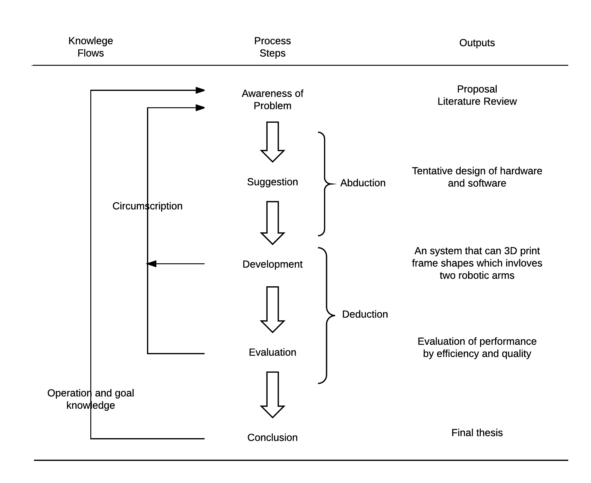

Figure 13 shows the process of this method. In the case of this project, (1) an approach will be developed by reviewing the previous wireframe printing research projects, so that problems and gaps can be found; (2) suggesting creative ideas based on the existing knowledge, resources and projects in the field of AM; (3) development and implementing which also involves some experiments, such as experiments with extruders and cooling units, at the early stage to ensure the idea can be implemented effectively; (4) then evaluating the printing results to find out unsolved or new problems and go into the next iteration; (5) finally, conclusion, the feasible approach, can be made after a number of iterations.


# Related Works
##  Conventional 3D Printing
Currently, there are two kinds of representative and commonly used 3D printing techniques. The two techniques are FDM and SLA (Stereolithography). FDM is the most common technique used in desktop 3D printers and robotic arm 3D printing (will be discussed in section 4).

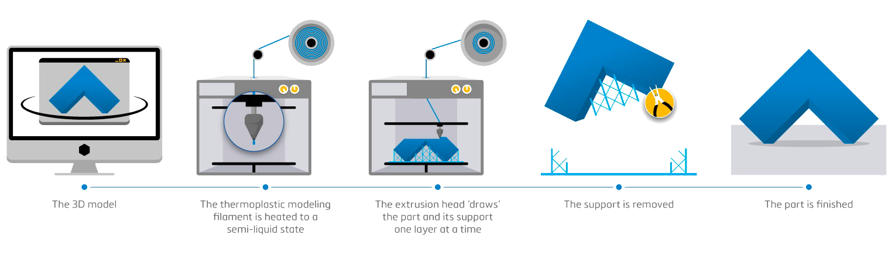

FDM 3D printing is invented by Scott Crump from Stratasys Ltd. As Figure 3 shows, this approach often involves three steps (Stratasys Ltd., 2017):

1. Pre-processing
In this stage, the designer uses a slicing software such as Cura (Ultimaker, 2017) and Slic3r (Slic3r, 2017) to slice the 3D model file into a series of layers. The software also generates a path of nozzle movement for extruding thermoplastic filament. The path and relevant information, such as filament flow rate and temperature of the heated nozzle is saved into a G-code file for production.

2. Production
The 3D printer uses a step motor to unwound a plastic filament from a coil and then send it into a heated print head which can melt the material into a
semi-liquid state so that the material can be extruded through a small- diameter nozzle. The nozzle moves in horizontal directions by a numerically controlled mechanism followed the path generated by the slicing software. The first layer of material is printed into a build platform. Then the next layer is printed onto the first one, and etc. until the last layer.

3. Post-processing
The designer removes the printed object from the build platform and then breaks away or dissolves support material in water. This process may also involve finishing. Finally, the part is ready to use.


FDM 3D printing technology is simple-to-use and low cost. However, it is also inherently time-consuming, especially when fabricating thin and tall shapes (B. J. Brooks, Arif, Dirven, & Potgieter, 2017) as it prints objects layer-by-layer and voxel-by-voxel using a 2.5D strategy (Figure 4). It takes 3 hours and 47 minutes even to print a 3D Benchy (Figure 5 (a)) designed by Creative Tools (2016) with a size of 60 x 31 x 48 mm on the Ultimaker 3 Extended 3D printer (Ultimaker B.V., 2017). As a result, the design iteration can be slow, down to a once or twice per day (Stefanie et al., 2014). In terms of material, the filament can only be printed on existing print material or the base plate rather than in empty space, so extra disposable support structures are often required (Figure 4 & Figure 5 (b)), which wastes time and material significantly (Dumas et al., 2014). These drawbacks of traditional 3D printing motivate us to develop an approach that can print shapes directly in the air using systems with more degree-of-freedom (DOF) such as robotic arms.

##  3D Printing with Robotic Arms
Articulated robots are widely used in various applications in the area of additive manufacturing (AM) (B. J. Brooks et al., 2017). Their end-effectors usually can move to anywhere with any orientation within their workspaces. This makes them be able to print more complex 3D shapes than conventional 3D printers can print.

  Direct 3D printing proposed by (Oxman, Laucks, Kayser, Tsai, & Firstenberg, 2013)
uses a KUKA KR5 sixx R850 (KUKA AG, 2017) robotic arm to do 3D printing. It first allows freestyle curves (Figure 6) to be printed in space directly rather than layer by layer as is the case with conventional 3D printing. The use of the robotic arm not only increases the possibility of 3D printing but also increases the build volume.

Mesh-Mould (Hack & Lauer, 2014) uses an ABB robot mounted on a mobile platform to 3D print meters-high structure which simplifies the concrete process in architecture. In their project, polymers are extruded in 3D space freely and precisely into the structure, then concrete can be poured into the formwork to construct a wall.

The Mesh-Mould project can only print zigzag patterns, while FrameFab (Yijiang et al., 2016) can print arbitrary wireframe by using a 6 DOF KUKA robotic arm. It segments a wireframe shape into several self-supporting parts with the lowest potential deformation and prints them in order to improve the overall quality of prints, but this project can not guarantee the local quality (printing quality of each single wire) because the force of gravity makes the wire sagging during the production process.


All of these projects show the possibility of 3D printing using robotic arms. They normally print 3D shapes in space directly, which has significant advantages over traditional 3D printing especially when printing thin and tall objects, wireframes and objects with a high percentage of overhangs. These advantages include saving support material, less printing time and requiring smaller build plates.

These projects have put a lot of effort on the mechanical design of their robotic 3D printing systems, such as custom-designed extruders, thermoplastic nozzles and air cooling units. However, in our research, firstly, we focus on using off-the-shelf
robotic arms, 3D printing nozzles, 3D printer controlling boards and etc. to realise the 3D printing system in order to reduce the cost. Secondly, the considerations of non-conventional 3D printing are researched to overcome the problems that occur in this kind of system.

## Considerations for Non-Conventional 3D Printing

One of the challenges of robotic arm wireframe 3D printing is that it is hard to make curves to be printed without deformation and stand rigidly in the air. Firstly, this problem leads to low-quality prints whose wires are sagging or even the whole print is out of shape.

 Secondly, this also makes it harder to print subsequent wires on already printed wires, as the print head can not locate the linking node which has shifted from the desired location.
Current research on direct fabrication is mainly focused on the following approaches to make the printed shapes more accurate and more rigid.

### Material
To maintain the stiffness of the model, wireframe printing always uses thicker nozzle than that used on traditional 3D printers. For example, Huaishu et al. (2016) use 1mm diameter nozzle to print wires.

Acrylonitrile-Butadiene Styrene (ABS) and Polylactic Acid (PLA) are two of the most commonly used materials in FDM 3D printing (Giang, 2017). ABS is more flexible than PLA. In other words, PLA prints are more prone to break than ABS prints when they are under pressure (Grieser, 2016). However, a key issue of ABS is that it is likely to shrink as it cools down (Powell, 2014). This feature of ABS leads to a serious problem that the robotic arm may have difficulty in locating the open ends of an already printed part while printing a new wire. One solution is to use a heated print bed to reduce the shrinkage, but it may not work for building large objects since the bed is not able to heat the whole printed part. In addition, it may also increase the cooling time of wires (see section 5.3). Finally, ABS is an oil-based plastic, while PLA is made from renewable resources, such as sugarcane or cornstarch (Grieser, 2016). This means PLA is biodegradable and more environmentally friendly than ABS. As wireframe printing is often used for low-fidelity preview of designs, PLA is much better to choose.

Some projects have been conducted to improve the strength of the materials themselves. By using materials with high strength, printed shapes can stand more rigid without too much deformation. Novikov, Jokić, and Joris Laarman Studio (2013) have conducted a research named Mataerial. In their research, they have developed a novel resin extrusion technology which can eliminate the effect of gravity on printed curves. It makes it possible to direct print artwork of almost any size and shape directly on irregular or non-horizontal surfaces (Figure 7). 

### Structure
Other research teams designed special structures to make the printed parts more rigid, especially objects of large volume. For example, the structure used in the project Mesh-Mould (Hack & Lauer, 2014) allows meters-high frameworks to be printed solidly which can be used for constructing formwork in architecture. 

Although the material they have used is traditional 3D printing material, the specially designed structure (a zigzag pattern) enables printed parts to support themselves after they have solidified.

Philip, Hao, Lei, and Liming (2016) designed secondary auxiliary structures to support the main structure inspired from spider silk which consists of spindle-knots
and joints to resist bending forces. By using this kind of structure, the system can make long (50 cm) curves printed in the air that are less likely to bend.

### Cooling System
The main factor which leads printed wires sagging is that the printed material solidified quite slow. To extrude material through the print nozzle, the print head
should heat the material to its melting point (around 190°C for PLA). This means the material is printed in a liquid state, in which the material is soft and bendable. Once the material is printed into the desired location, it is good to make it cool down faster so that it cannot be dragged down by the gravity force easily.

As wireframe printing always use thick nozzles, it becomes more important to implement a cooling system because the thicker the filament is, the longer the cooling time needed.

In order to make the printed parts solidify in relatively short time, several cooling systems have been designed.

Some of them use air cooling. For example, (Philip et al., 2016) designed a specialised print head which has five air cooling tubes around the nozzle (Figure 8). The tip of each tube is narrowed to allow a strong air flow from the tube in order to make printed material solidify as fast as possible. Similarly, Yijiang et al. (2016) use two air cooling tubes connected to an air compressor and controlled by a solenoid valve. They found that best result can be achieved by using air flow of 0.02 mpa.

Some others use mist cooling system. On-The-Fly Print (Huaishu et al., 2016) designed a cooling system which consists of two SU11 atomiser nozzles on each side of the printing nozzle. They can create a mist that can cool down the printed parts rapidly. By doing this, the time needed for cooling pauses is significantly reduced, which saves four-fifth time compared to a normal fan cooling (ibid.).

### Velocity Constraints

Printing speed should be limited to ensure the quality of wireframe printing (Yijiang et al., 2016). Printing too fast may lead to sagging edges. The reason why this problem may occur is that the next part of the edge is printed before the earlier printed part has completely solidified. The faster the printing speed, the longer the part will be in a soft state in the air, and it more likely to bend due to the force of gravity. Printing too fast may even exceed the maximum matching extrusion speed, which leads to insufficient material coming out of the nozzle. As a result, thin wires are printed. Yijiang et al. (2016) found that the best end-effector moving speed is 0.00132 m/s during printing an edge in a wireframe shape.


## Articulated Platform

Conventional FDM 3D printing uses a horizontal build platform (also called print bed) to hold printed objects. As the filament can only be printed on existing print material or the print bed rather than in empty space, extra disposable support structures are often required (Figure 4), which wastes time and material significantly (Dumas et al., 2014). In addition, support material often leaves visible traces which are hard to remove completely.

As mentioned in the research aim, this project will research the use of a second robotic arm to move and rotate the print platform to eliminate the sagging problem
that other 3D wireframe printing techniques have. Some research group have included articulate platforms into their project. These projects will be discussed in this section.

Robot-assisted 3D printing of biopolymer thin shells (B. J. Brooks et al., 2017) uses an ABB IRB 120 industrial robotic arm (ABB Group, 2017) to build a three- dimensional curved articulate platform. This adds more DOF to conventional 3D printers so that it can extrude material on curved layers instead of flat layers. As a consequence, support material required for printing large convex shapes can be saved. However, this project can only print thin shell shapes with a certain degree of curvature because the shape of the platform is fixed (Figure 9).

Tolar and Herrmann (2016) developed a prototype of a novel 3D printer which has a three DOF print head and also a three-axis rotatable print bed, in total 6 DOF to allow objects with large overhangs to be printed without any support material because the system can rotate the platform to ensure any extruded material is printed on the top of already printed parts (Figure 10).

## Support-free 3D printing


# Methods
system overview, block diagram, 

## Controlling System
An integrated system controlling both robotic arms and a 3d printing system

### System Architecture

#### Hardware

##### platform

Material for print bed should satisfy two contradictory requirements that are (1) the print bed must stick to the filament in order to hold the print firmly; otherwise, layers will not be aligned or even collapse. (2) the print bed must not stick to the filament too strongly so that the finished print can be removed from the print bed (http://reprap.org/wiki/Bed_material). In addition, the choice of print bed is also related to print material. As PLA has been chosen, 

Printing on glass requires moderate heating (60 C / 70 C) (https://www.matterhackers.com/news/choosing-the-right-3d-print-bed-surface, https://www.matterhackers.com/articles/how-to-succeed-when-printing-in-pla)

Because PLA does not require a heated print bed, and PLA stick well to acrylic (http://www.plasticscribbler.com/tutorial/how-to/item/95-top-five-reasons-your-prints-dont-stick-to-the-bed#.WerP9BOCwuQ). 


Several reasons lead that acrylic print bed has been chosen.

1. Because the accuracy of the robotic arm and the levelling of the table is not good enough, the print bed must be adjustable. 
2. To make it easy for adjusting the position, grids need to be marked on the print bed. Acrylic is easy to cut using a laser cutter and mark on
3. Low cost

For laser cutting lines, red Red: RGB: 255,0,0

For vector engraving, Blue: RGB: 0,0,255
  
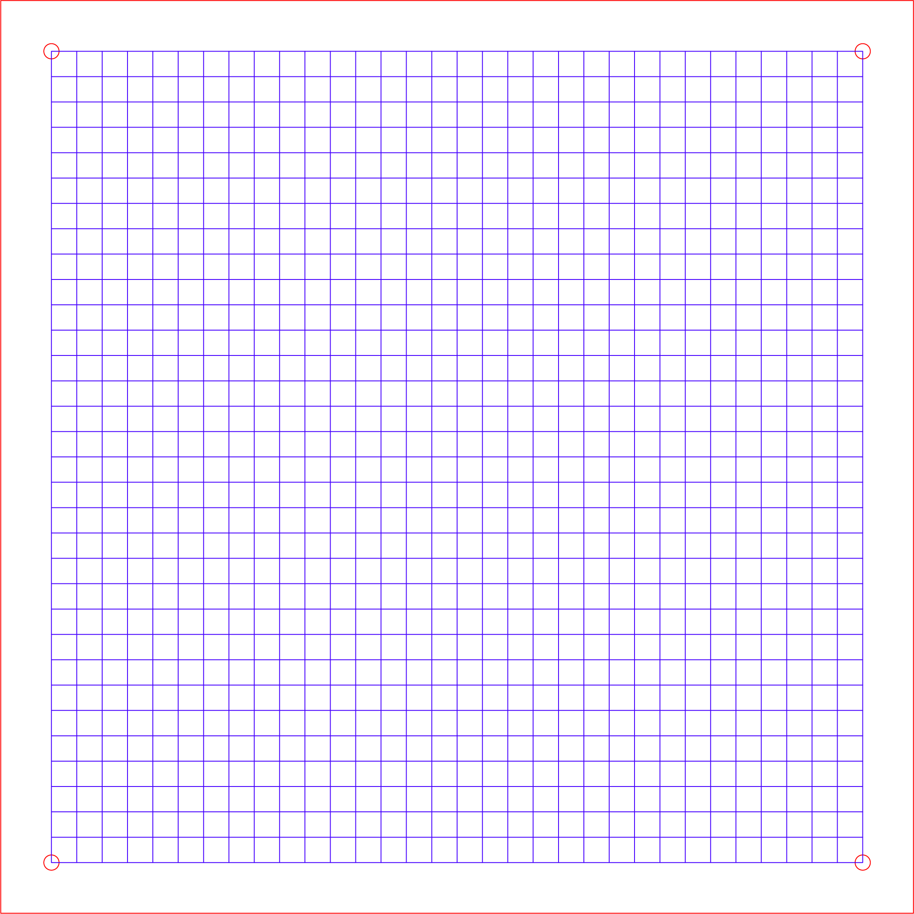
  
  But the drawback of this material...
  
  An acrylic print bed does not last forever. It is reusable for several times and then become disposable because acrylic is more flexible than glass. The print head applies pressure on the bed during printing. During our experiments, we found that the acrylic can be out of shape after applying pressure on it for a long time. In addition, tiny piece of material is hard to remove from acrylic print bed. Third, it is not strong enough, it can break if removing the print too hard.
  

  [a picture shows tiny material on the print bed, grid, broken bed]
  
  At the first stage, a fixed print bed is installed on the table to allow one robotic arm holding the nozzle to print on
  
  Then adjustable print bed is designed and installed on the second robotic arm so that the print bed can rotate. To ensure free movement of the robotic arm, 18 * 18 bed is designed

But as print higher, the print is difficult to stick to the platform, it has a curve on the bottom.

We tested printing on Blue Painter's Tape, it is not stick to 

By analysing the video, we found that the the print gives pressure to it, makes it bend

The number one reason why you would have trouble with your parts not sticking is a uneven build plate.  This problem can also lead to part warpage and/or gaps in between layers. （http://www.plasticscribbler.com/tutorial/how-to/item/95-top-five-reasons-your-prints-dont-stick-to-the-bed#.WerP9BOCwuQ）

So we added support between two piece acrylic

  first layer print very close (n mm) to the platform
  
  right 

Then software needed to level the platform

similar to 3d printer, it goes through four corners of the platform, and buttons can be used to move the platform so that it is level

Also the grids on the platform helps this process, because the print is in the air, the print head need to relocate the open edges so that it can continue to print. This is why the grid is needed which does not need in the conventional 3D printer.

##### 3d printing control circuit

RAMBo - (R)epRap (A)rduino-(M)ega-compatible (M)other (Bo)ard.

It is an open source 3D printer control board, it supports 2 hotends, 1 heated bed, 3 fans, 4 thermistors, 5 1/16th microstep motor drivers and USB RS232 which is enough for this research
Reflashable using the Arduino IDE and setting board to "Arduino Mega 2560"
(https://ultimachine.com/products/rambo-1-3)

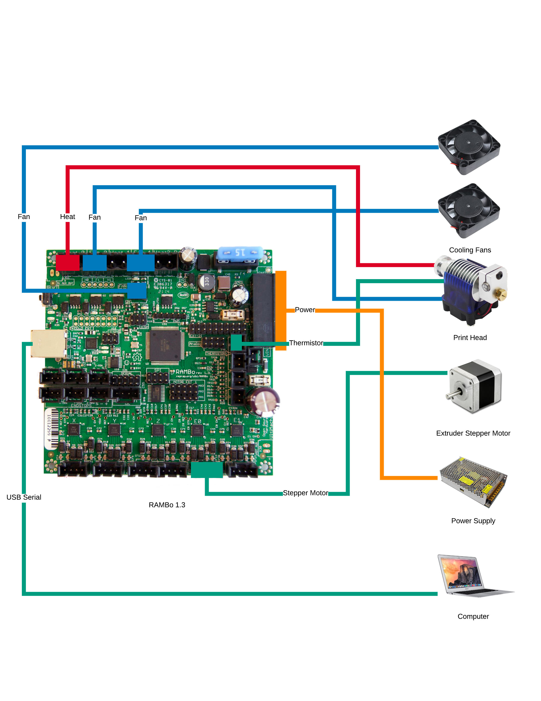

  [circuit diagram goes here]
  
  The picture above shows the circuit diagram of the 3d printing system. two fans which used for cooling connect ...

##### extruder and holder

  A step motor is used to send the material to the nozzle
  
  The extruder should hold the filament firmly so that it can accurately control the amount of material and speed to print which is important to 3d printing to ensure the quality.
  
  A bearing is installed with a spring so that they can hold the filament
  
  [design file of the extruder holder]


##### fan holder - as small as possible

  In the cooling system section, we found that 
  
  For slinky and freeform printing the cooling system is not enough, because it needs printed material be solidified before it can print the next part, otherwise, the wire can be sag. The efficiency of the cooling system affects the printing speed. It takes 3 hours to print a slinky with n circles, and takes 12 hours to print the candle holder. If the cooling system can be much efficient, the print speed can be faster. Another issue with the freeform printing is that when the print speed is low, the extruder must also reduce the speed to feed less material in a time unit, otherwise, it will be over extrude. The problem with this is that the step motor is n degree per step, when the 
  


  [fan holder picture]
  
##### filament holder

It also must not block the way that robotic arms move. We mount the filament on the table outside of the workspace of these two robotic arm at first. But later we found that because the link between extruder and the nozzle is not a hard link (a plastic tube is used), the filament wheel always drag the extruder which makes the horizontal center of the extruder and the nozzle not in line. As the print head moves further from the filament wheel, the distance between the two are longer, because the extruder hold the filament firmly, it delay the time when the filament should come through the nozzle, eventually reduce the quality of prints.


Reduce the angle of the filament feed into the extruder can reduce the force in horizontal to the extruder, so that it can not be dragged too much.

[reduce angle]

The filament holder should hold the filament on top of the print head, so that the filament can be feed into the extruder smoothly. 


  
 

#### Software

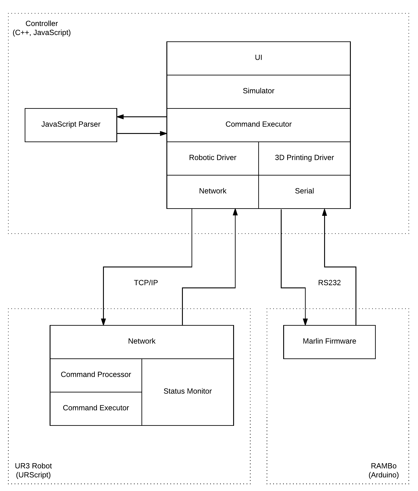

##### urscript

Because of the limitation (does not support type casting, complex calculation) of urscript, a controller program is required to be run on a separate computer.

* command processor

  It process messages sending from the controller, eg. called UR robot's built-in functions to convert ...
  
  Also determine which type of movement it used

* command executor
  It execute the movements by calling UR robot's built-in functions
  
  Important functions:
  
  [table of functions]

* status monitor
  It monitor the status of the robot, including position of tool, joint speeds, task speed, etc. and send this data to the controller through network


##### controller

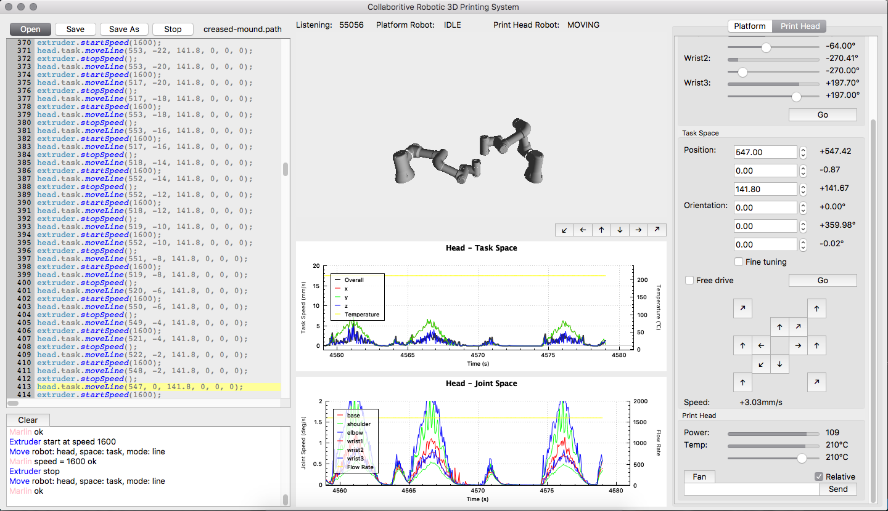

  User interface
  
  On the left side, it is the path editor, user can view and edit the commands which can control the whole system. User can open and save a path file. There is also a run/stop button, which is used to start and stop the path file.

  At the bottom-left corner, it is a terminal, which shows the execution of the commands and status of the printing system.
  
  In the center of the software, it shows the current gesture of the robotic arms, by switching the ur robots into simulation mode, it can simulate the movement of robotic arms which help to find problems before it do a actual print.
  
  On the right side, users can control these two arms individually using sliders and buttons, users can also enable the free drive mode so that they can move the robot using their hands.
  
  C++ because hardware libraries use these languages (https://blog.robotiq.com/what-is-the-best-programming-language-for-robotics) for real time performance, robotics is very dependent on real time performance
  
  Qt is chosen because it is a C++ based firmware which enables cross-platform

###### Software architecture

  * simulation
    * opengl
  * command executor

  In order to make the system flexible, command executor is designed. Instead of hard code the robotic arm movement command and 3d printing system command in to the controller, these commands are separated into command files. Users can load the command file into the controller and the controller parse the commands and then execute the command in order to control the system.
  
  JavaScript has been chosen because it is a script language which will be complied during runtime this makes
  
  with a series of commands within a file that is capable of being executed without being compiled (https://www.computerhope.com/jargon/s/script.htm)
  
  easy to write and modified
  
  It is easy to implement loop and conditional structure which makes the script powerful
  
  Because script is slower than a compiled program (https://www.computerhope.com/jargon/s/script.htm), it can not used directly for controlling the robotic 3d printing system. The speed of the system is depend on the slowest component in the system. Event the controller is fast, but the script is slow. It is also slow. 
  
  To solve this problem, make it also flexible and efficient, the script has been precompiled into a series of command that can directly used for controlling the system without any computation
  
  So the whole system consists of script interpreter used to compile the control file into a series of commands. Then a command executor is used to execute these command by sending them to the robotic arm controller or the 3d printing controller.
  
  By doing so, the script can both be flexible and efficient

  * driver

##### 3d printing firmware

  G code used in robotic 3d printing
  G1
  fan
  temp - thank for auto tune, the pid of temp control pid tune can be done automatically.

  Marlin (http://marlinfw.org/) is a open source 3d printer firmware which allows full control of the printing process. It is easy to be modified so that it can adapt the robotic 3D printing
  
  The amount of material for a single movement is calculated by slicing software which is included in gcode file. But for freeform printing and wireframe printing, because of the amount of material when print vertically, horizontally, print the first layer, print on top of existing material, print in the air, is different. And it also differ from different materials, especially when using thicker nozzle. In addition, in rotating platform printing, the flow-rate of extrusion with in a single layer may change. So an easier approach to do this is not control the amount of material to be extruded. It is to use two extrusion operations:
  
  operations: start extrude at speed, stop extrude
  
  In order to achieve this, changes on firmware are required. We introduced two customized gcode for these two operations
  
  G998 SPEED - use negative number for back extrude
  G996
  
  Because of the control machinism of step motor is different, the existing one is extrude by amount
  
  The G code for traditional extrusion are remain not changed, so they are still supported
  

  * modified extruder controlling

###### microstepping
  
  Essentially, the goal of this process is to create a motor that runs as smoothly as possible. Due to the nature of step motors, their rotation is not entirely smooth, as the motor is moving “step by step” Of course, these steps are designed to be moved through rather quickly, so there is usually no particularly detrimental effect on performance, but for those who require smoother resolution, the full step stepper motor may not be quite what is needed. (http://www.nmbtc.com/step-motors/engineering/full-half-and-microstepping/)
  
  https://hackaday.com/2016/08/29/how-accurate-is-microstepping-really/
  
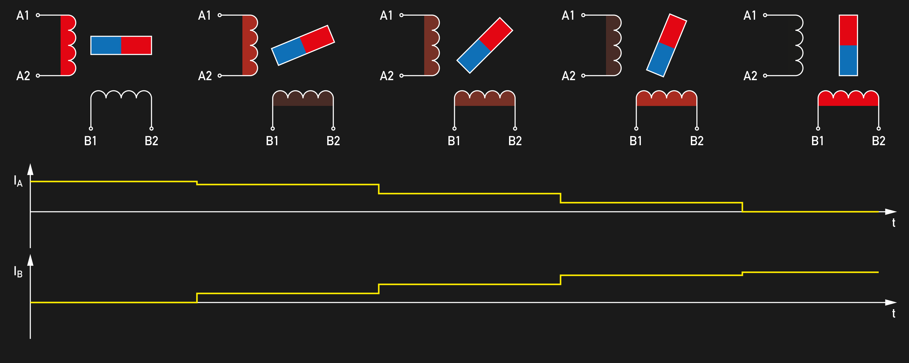
  

42BYGHM809 0.9 +=5%
400 steps/rev
400 * 8 =3200 steps
2 phase
(https://cdn.sparkfun.com/datasheets/Robotics/42BYGHM809.PDF)

Microstepping is a technique that increases motor resolution by controlling both the direction and amplitude of current flow in each winding. Current is proportioned in the windings according to sine and cosine functions. (http://www.nmbtc.com/step-motors/engineering/full-half-and-microstepping/)

This is where the microstepper controller comes in. The microstepper controller is a driver that sends pulses to the motor in an ideal waveform for fluid rotation. The idea is for the driver to send current in the form of sinewaves. Two sinewaves that are 90 degrees out of phase is the perfect driver for a smooth motor. If two step coils can be made to follow these sinewaves, it results in a perfectly quiet, smooth motor with no detectable “stepping”.

This is because, in such a case, the two waves work together to keep the motor in smooth transition from one pole to the other. When the current increases in one coil, it decreases in the other, resulting in smooth step advancing and continuous torque output at each position. A normal bipolar stepper driver does not have these smooth wave forms. As a result, the motor transitions are not as smooth. In most applications requiring stepper motors, assuming an ideal driver situation. In reality, the wave forms can deviate significantly, resulting in what is called “resonance”, which is a phenomenon that creates problems for mechanical systems. Microstepping reduces resonance issues by controlling the waves so that this type of deviation does not occur.

A microstepper controller subdivides the motor step angle into multiple divisions to improve control over the motor. This allows for more refined motor work that requires greater motor resolution. (http://www.nmbtc.com/step-motors/engineering/full-half-and-microstepping/)

A4982 DMOS Microstepping Driver
(www.allegromicro.com/~/media/Files/Datasheets/A4982-Datasheet.ashx)

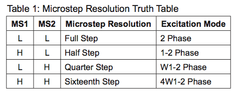

By writing HIGH level to both MS1 and MS2 pin, it can set the stepper motor to microstepping mode with 1/16 step resolution. This significant improve the quality of the print

Enabling microstepping does not the fully solve the problem, the temperature is also a important to the printing quality. When printing with a very slow speed (how slow), the filament come through the heat block has all been fully heated. If the temperature is high, it can boil the material and produce some bubble which cause the print not smooth.

195℃

Reducing the temperature also help increase the cooling speed, so the material can solidify quickly which also reduced the sagging problem

[picture to compare high temp and low temp]

[picture to compare microstepping and non-microsteping]

## Freeform Printing
* slow movement - slow extrusion
* small step angle - slow extrusion
* high speed fan - faster solidified
* bigger nozzle - stable

print parameters
space speed 1mm/s
extrusion speed 200

### Freeform printing with solid core
* solid core: maintain the overall shape


* algorithm to generate the shape

  shape can be generated using formula ...
  
  [picture and formula used]
  
  
print in the air without support

  


### Slinky printing
**flat nozzle**???
**smaller angle step motor**??? - micro stepping
3m7s / layer

First problem with slinky printing is how to make sure adjacent layers are not stick to each other. Each two layers have a small gap between them. 
The gap can not be big, otherwise, the circle will become smaller when print higher. 

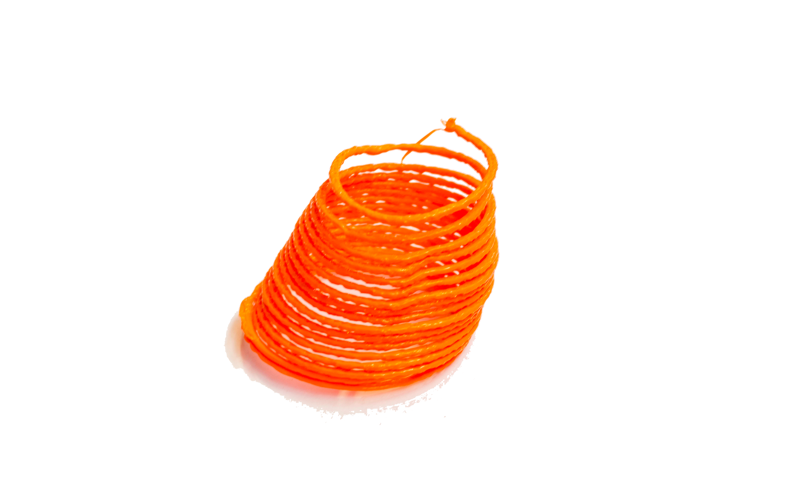

[force picture]


## Articulated Platform Printing
### Generalised cylinder
* different modeling approach - carrier, profile - bezier path

  

  [picture of carrier and profile]
  
  It is convenience for two robotic arm to print using this approach, the platform can rotate follow the carrier line with a contrast angle

[picture of a contrast angle]

* different layer-height within one layer - algorithm
  

* rotate between layers - strength

  One advantage of rotating platform is ensuring better strength of prints, because it is consistent without 
  
  Although the repeatability of robotic arm is +- 0.1mm, because of the flexibility of the print bed, the shaking of the table. Once the robotic arm moved a long distance and come back, it is unlikely it still in the same position. This leads to the strength is not good because it is not seamlessly.
  
  The approach is to print layers seamlessly at the same time rotate the platform. So the layer height is different within one layer.
  


  [picture of rotate layer with different thickness]

* no support structure needed

  Because material is always printed on top of existing material, there is no need for extra material to print.
  
  

#### Tube Printing
* layer computing algorithm

During the print, some issues has been revealed.

The controller program takes more than 90% cpu. Then the program becomes very slow. So that the command could not been sent to both robotic arm and 3d printer system timely. For example, two commands should be sent to these two system at the same time, the robotic arm start to move and the print head start to print, but if the two commands arrived at different time, the nozzle already start to print material before the robotic arm move. It cause extra material to be printed.

In order to print curve instead of straight line, the way robotic arm works is that it needs a series points close to each other follow the shape of the curve so that the robotic arm can move across these points one by one.

according to the resolution and the size of a print, the number of points needed for one layer is different, in our experiments, 3mm / point is acceptable for printing smooth surfaces. for a tube which diameter is 60mm, needs 63 points to be sent to the robotic arm for per layer

at first these points are sent to the robotic arm one by one, which has been found increased the cpu usage.


[failure print of sending points one by one] [successful print]

##### blending
blending is required when robotic arm move a curve, 

t a constant speed along its entire path between waypoints and around circular blends. As shown in the below diagram, a basic moveP is defined as at least 3 waypoints with a shared blend radius between all waypoints under the moveP. The blend radius is centered at the waypoint, then intersects with the path at tangential points along the radius’s circle. (https://cross-automation.com/blog/universal-robots-provides-unique-solution-dispensing-applications)

because speed is critical to robotic 3d printing, sudden stop or increase or decrease can cause inconsistent print which leads to rough surface on the print

Also when it print different layer hight, the time need to be calculated so that when the robotic arm move to the certain position, the extrusion speed can be adjusted to a corresponding number so that it print less material when the hight is low, and when it print higher layer, it can extrude more material. If the speed is inconsistent, it is unlikely to controller the extrsion speed. because we can't use speed sensor the detect the speed, because it always has delay. it can cause the print out of shape.

without blending, it also reduce the life of robotic arm because of sudden stop and start

it also cause the table shake, leads to inconsistent print
 


The reason behind this is that when robotic arm move a series of points in the space in order to move a complex path

#### Vase Printing
* path generating algorithm
* base-filling algorithm


##### Scan Line Polygon Fill Algorithms
Vase printing can also be printed using the generalized cylinder printing approach, but it need a base to be printed so that soil does not leak from the bottom.

Each layer of a print is a closed path, so we can use scan line polygon filling algorithm to generate the path for base filling.

Step 1 − Find out the Ymin and Ymax from the given polygon.

Step 2 − ScanLine intersects with each edge of the polygon from Ymin to Ymax. Name each intersection point of the polygon. As per the figure shown above, they are named as p0, p1, p2, p3.

Step 3 − Sort the intersection point in the increasing order of X coordinate i.e. (p0, p1), (p1, p2), and (p2, p3).

Step 4 − Fill all those pair of coordinates that are inside polygons and ignore the alternate pairs.

https://www.tutorialspoint.com/computer_graphics/polygon_filling_algorithm.htm

[line fill]

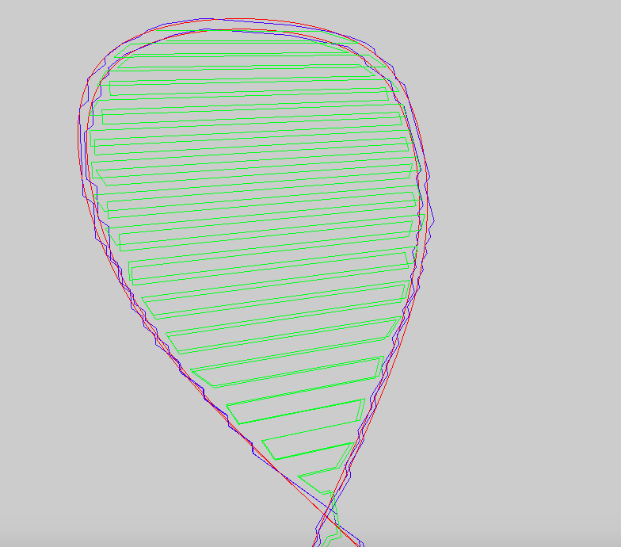


## Wireframe Printing
Freeform + Rotating platform
* rotating platform -> never print vertically -> eliminate the sagging problem

Robotic control

For printing a cube, it is impossible to print all 12 edges in one go. So the print head need to print some edges and then move the another place without extruding material and start to print again. This leads to two main problems (1) stringing problem drags the printed edge (2) the print head needs to locate a printed vertex of a cube in order to continue the print. In the following section, these two problem and solutions to them will be discussed.

### Retraction
3D prints sometimes show small strands of plastic on places where the Ultimaker shouldn’t print and the print head must only travel from one place to another. These unwanted strands of plastic is called stringing. (https://ultimaker.com/en/resources/19504-how-to-fix-stringing)

At the places in a print where the printer has to do a travel move between two printed parts and you don’t want it to leave plastic in between the use of retraction is important. This means that the filament is pulled back a little bit by the feeder, so that it doesn’t leak from the nozzle during the travel moves. (https://ultimaker.com/en/resources/19504-how-to-fix-stringing)

Retraction is used to 'cut' the filament so that when a edge has been finished print, the remaining material will not go out of the extruder and stringing (https://www.matterhackers.com/articles/retraction-just-say-no-to-oozing)


The stringing is a very harmful when it comes to thick nozzle because the string become much thicker than the one made by a thin nozzle. The print head may drag the string together with the printed part away especially in wireframe printing, because a wire is easier to be dragged then a solid object.

For conventional 3D printer, it’s unlikely you should need more than 5mm or less than 1mm. (https://www.matterhackers.com/articles/retraction-just-say-no-to-oozing). But for a thick nozzle, a small amount extraction does not enough for solve the stringing problem. After a series of experiments, 10mm retraction is able to prevent the thick stringing problem. Even though, there are still think string between two parts because of the thick nozzle, but they are thin enough that it cannot drag the print part away.

[photo with retraction and without retraction]

### Link nodes
Because the accuracy of the print machinism, it is hard for the print head to locate to opening ends in a cube and continue to print other edges. 

Solution:
Print 4 edges on the platform. To minimize the number of nodes the print head needs to locate in order to improve the quality, it print one edges vertically from the position 


Print horizontally, it will sag because of the gravity

### Cooling
Cooling is especially important when printing edges in the air because if the material is still hot and soft, it is very likely to be out of shape because of any kind of force, such as wind, shaking and gravity.

The cooling system must be efficient to reduce the amount of time that printed material are in a soft state.

The wind must distributed evenly to the printed material; otherwise, it will blow the printed edges bend to one side.


[fan install picture]

# Evaluation

To show this novel 3D printing system is superior to conventional 3D printing system in terms of saving support material and printing time, three representative models are printed using both two systems. In the following section, the amount of material and time required in both two approaches are listed and compared.

The first model we have compared is the bended pipe mentioned before. Because instead of using a 3D modeling software to design the print, carrier-profile functions are used for defining the model, in order to print the same model in a conventional 3D printer, the description file need to be converted into a mesh so that slicing software can generate a gcode file for a 3D printer from it.

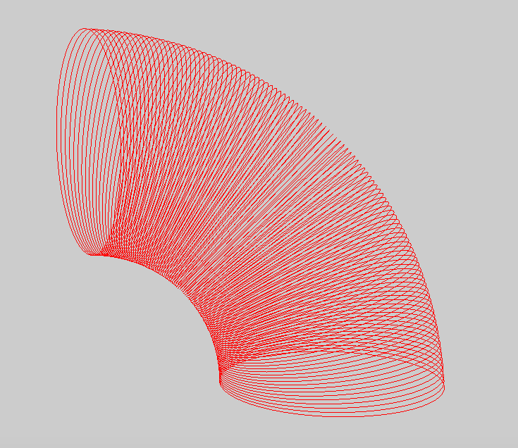

The path of print head movement can be virtualised as shown in the picture above. The path consists of a series of intermediate points, for each layer, the number of these points are the same. A program has been written to convert this path to a mesh. It goes through all layers, between each two layer, two adjacent points in one layer, and the two corresponding two points in another layer can produce a triangle. By linking these triangles together, a mesh can be produced.

In order to make the mesh printable, we also need to do meet 3D printing guidelines (https://www.shapeways.com/tutorials/how-to-prepare-your-render-animation-model-for-3d-printing). First, the model need to be a single solid seamless volume by having closed edges (https://www.lifewire.com/how-to-prepare-your-model-for-3d-printing-2109). The current mesh we generated is an open mesh where two ends of the pipe are open. A inner wall is needed. Second, any normal that faces inward is treated as a hole by the slicing software. However, the model we generated does not have any normal, so it can be ignored. Third, internal geometries should also been avoided. Fourth, walls which are too thin are also not printable. The minimum wall thickness can be calculated by doubling the line width (or the nozzle diameter) because the printer prints two shells for a wall: one for inside and one for outside (https://ultimaker.com/en/resources/22015-designing-for-printability). In this case, the printed we used for this experiment has a nozzle ..., so the minimum wall thickness is ...

[picture of converting path to mesh, triangle]

Cura supports STL, 3MF and OBJ file formats (https://ultimaker.com/en/products/ultimaker-cura)
The OBJ file format is a text file format (https://www.cs.cmu.edu/~mbz/personal/graphics/obj.html), which is easy to be edited.

v x y z

The vertex command, this specifies a vertex by its three coordinates. The vertex is implicitly named by the order it is found in the file. For example, the first vertex in the file is referenced as '1', the second as '2' and so on. None of the vertex commands actually specify any geometry, they are just points in space.

f v1[/vt1][/vn1] v2[/vt2][/vn2] v3[/vt3][/vn3] ...

The face command specifies a polygon made from the verticies listed. You may have as many verticies as you like.

MakePrintable is a web app that helps debug 3D printing models (https://makeprintable.com), which can identify issues within an unprintable 3D model.

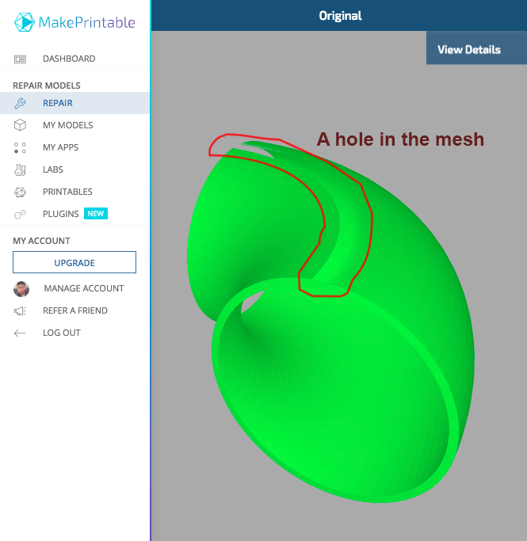
 
The second model we compared is the slinky. The model we used for slinky is designed by Desktop Makes (https://cults3d.com/fr/mod%C3%A8le-3d/jeu/slinky).

The third model printed is the wireframe cube. This model can be easily modeled using Maya (https://www.autodesk.com.au/products/maya/overview). Twelve edges are merged into a single mesh so that it can be printed on a 3D printer.


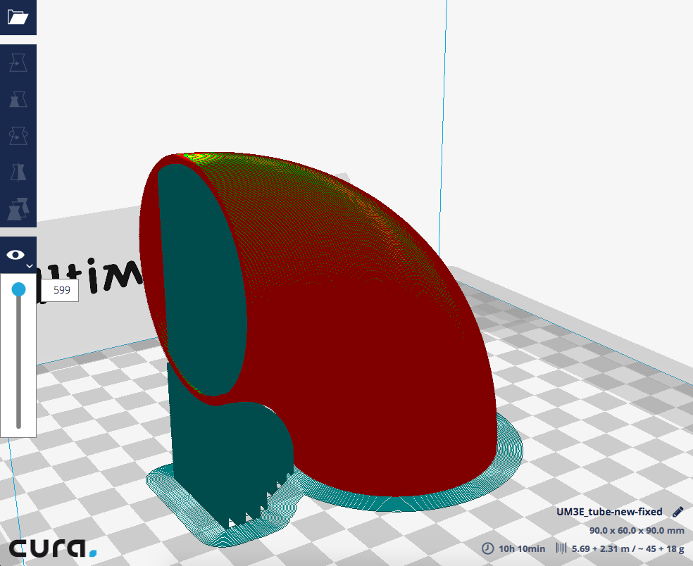

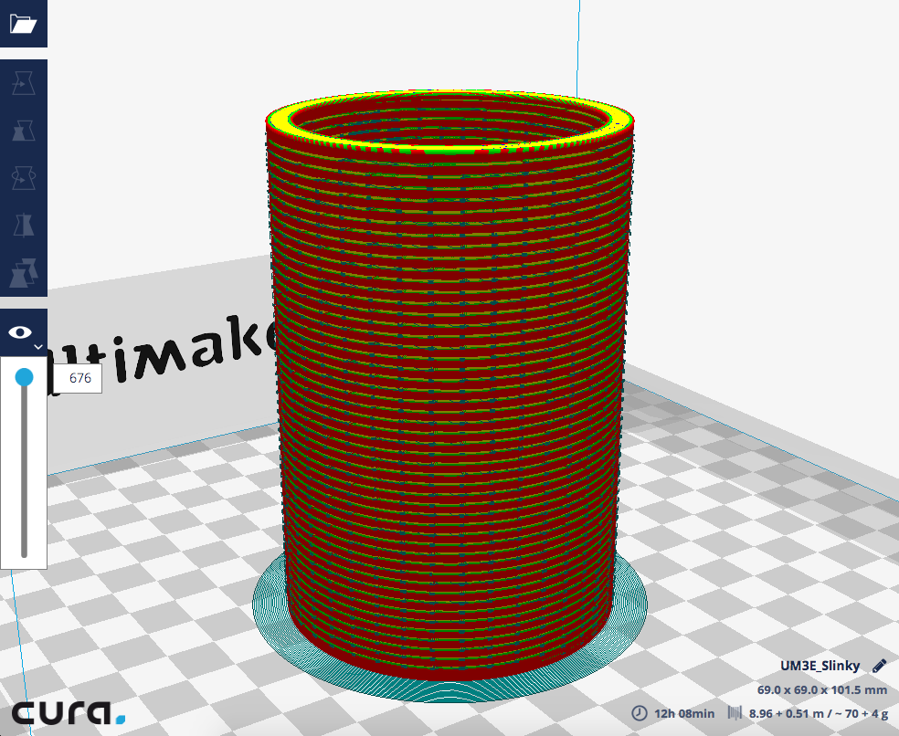

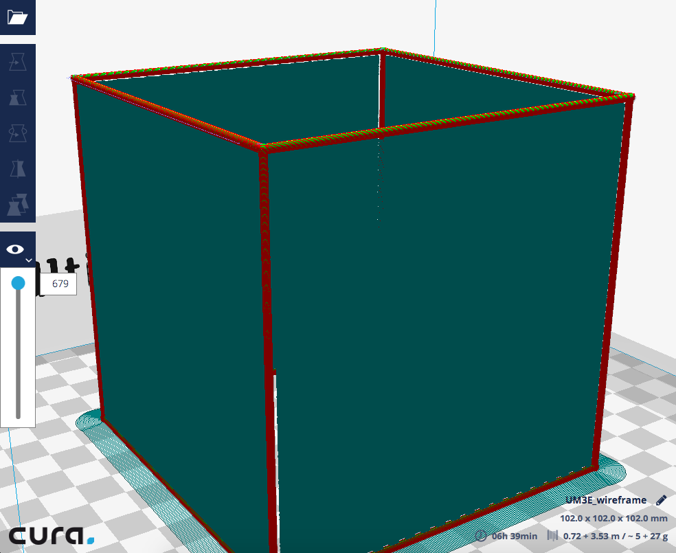

compare
* possibility - to conventional
  * freeform
  * slinky
* time - to conventional
  * tube
  * cube

    table
* quality - to conventional
* material usage - to conventional
  * tube
  
* strength - to RoboFDM
  * **how to measure**???

# Discussion and Analysis
how flexible
adv disadv
good at, not good at
accuracy, repeatibility
cooling


for freeform printing, 


propose future work, some idea, if more time


The 

With current configuration (two robotic arms are mounted on the same table), the workspace of the two robots are limited, because of the existing of the table. It is worth to invest a separate holder that can mount a robotic arm on, so that there are more space for the robot, in order to print larger object.

[picture of mount suggestion]

One limitation of this approach is that if the model has parts that are not connected in one layer, and these parts can not be printed in the same rotation of platform, it needs to stop extrusion, move to the next part need to be printed and start to extrude again. 

Because this research only focus on proofing the concept of articulated platform can help eliminate support material, thick nozzle is used to allow faster preview of the print. By using thick nozzle, the print quality will be low which can be improved in the future research

Wireframe printing cannot be generalised, so that any model can be converted to wireframe and then print using this approach. Because this research only focus on the problems occurs during the print and how to use two robotic arm to improve the quality reduce the sagging problem. There is already several research done the converting process. But in the future study, it is worth to combine them together so that it can be used in production.

For the temperature control, because thick nozzle is used, the extrusion will reduce the temperature significantly. The auto tune process within the Marlin is not tune the pid parameters when the printing head printing. It is good to modified the firmware so that it can tune different pid parameters for different flow rate so that the temperature can be controlled more precisely 

Because of the cooling system is not efficient enough, so when doing freeform printing, the speed is very low, Also the fans occupied some space, so the two wires can not be print too close to each other (min ?mm). In the future research, much effective and compact cooling system can be experimented.

For slinky printing, it is worth to experiment with flat nozzle instead of round nozzle, because 

# Conclusion


clear aim, whole paper refers to the aim, why do I try this 
research strong focused planned 

how difficult why difficult how
make changes to improve
