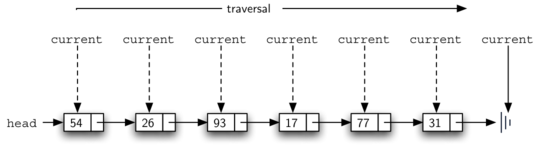
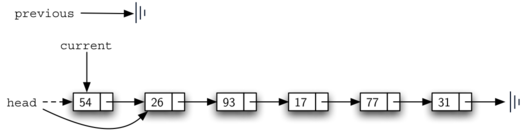

# Basic Data Structures
## Linear Structures
How items are added or removed distinguishes one linear structure from another

### Stacks
> The addition of new items and the removal of existing items always takes place at the same end

#### Properties
* TOP and BASE
* LIFO: last-in first-out


#### When to use
* Reverse the order of items
* Every web browser has a Back button. As you navigate from web page to web page, those pages are placed on a stack

#### Implementation
* `Stack()` creates a new stack that is empty. It needs no parameters and returns an empty stack.
* `push(item)` adds a new item to the top of the stack. It needs the item and returns nothing.
* `pop()` removes the top item from the stack. It needs no parameters and returns the item. The stack is modified.
* `peek()` returns the top item from the stack but does not remove it. It needs no parameters. The stack is not modified.
* `isEmpty()` tests to see whether the stack is empty. It needs no parameters and returns a boolean value.
* `size()` returns the number of items on the stack. It needs no parameters and returns an integer.

```python
class Stack:
     def __init__(self):
         self.items = []

     def isEmpty(self):
         return self.items == []

     def push(self, item):
         self.items.append(item)

     def pop(self):
         return self.items.pop()

     def peek(self):
         return self.items[len(self.items)-1]

     def size(self):
         return len(self.items)
```

#### Simple Balanced Parentheses
Balanced parentheses means that each opening symbol has a corresponding closing symbol and the pairs of parentheses are properly nested

Write a program to decide whether the symbols are balanced

##### Analyse
* the most recent opening parenthesis must match the next closing symbol
* the first opening symbol processed may have to wait until the very last symbol for its match


If a symbol is an opening parenthesis, push it on the stack as a signal that a corresponding closing symbol needs to appear later. If, on the other hand, a symbol is a closing parenthesis, pop the stack. As long as it is possible to pop the stack to match every closing symbol, the parentheses remain balanced. If at any time there is no opening symbol on the stack to match a closing symbol, the string is not balanced properly. At the end of the string, when all symbols have been processed, the stack should be empty. 

#### Balanced Symbols (A General Case)
The general problem of balancing and nesting different kinds of opening and closing symbols (`{[()]}`)

```python
from pythonds.basic.stack import Stack

def parChecker(symbolString):
    s = Stack()
    balanced = True
    index = 0
    while index < len(symbolString) and balanced:
        symbol = symbolString[index]
        if symbol in "([{":
            s.push(symbol)
        else:
            if s.isEmpty():
                balanced = False
            else:
                top = s.pop()
                if not matches(top,symbol):
                       balanced = False
        index = index + 1
    if balanced and s.isEmpty():
        return True
    else:
        return False

def matches(open,close):
    opens = "([{"
    closers = ")]}"
    return opens.index(open) == closers.index(close)


print(parChecker('{{([][])}()}'))
print(parChecker('[{()]'))
```

### Queues
> the addition of new items happens at one end, called the **rear**, and the removal of existing items occurs at the other end, commonly called the **front**. (think of a queue to buy tickets, new customer go to the rear of the queue)

#### Properties
* RARE and FRONT
* FIFO - first-in first-out / first-come first-served


#### When to use
* When students want to print, their print tasks “get in line” with all the other printing tasks that are waiting
* Operating systems use a number of different queues to control processes
* The keystrokes are being placed in a queue-like buffer so that they can eventually be displayed on the screen in the proper order

#### Implementation
* `Queue()` creates a new queue that is empty. It needs no parameters and returns an empty queue.
* `enqueue(item)` adds a new item to the rear of the queue. It needs the item and returns nothing.
* `dequeue()` removes the front item from the queue. It needs no parameters and returns the item. The queue is modified.
* `isEmpty()` tests to see whether the queue is empty. It needs no parameters and returns a boolean value.
* `size()` returns the number of items in the queue. It needs no parameters and returns an integer.

```python
class Queue:
    def __init__(self):
        self.items = []

    def isEmpty(self):
        return self.items == []

    def enqueue(self, item):
        self.items.insert(0,item)

    def dequeue(self):
        return self.items.pop()

    def size(self):
        return len(self.items)

```

#### Simulation: Hot Potato
In this game children line up in a circle and pass an item from neighbor to neighbor as fast as they can. At a certain point in the game, the action is stopped and the child who has the item (the potato) is removed from the circle. Play continues until only one child is left.

Upon passing the potato, the simulation will simply dequeue and then immediately enqueue that child. After num dequeue/enqueue operations, the child at the front will be removed permanently and another cycle will begin


```python
from pythonds.basic.queue import Queue

def hotPotato(namelist, num):
    simqueue = Queue()
    for name in namelist:
        simqueue.enqueue(name)

    while simqueue.size() > 1:
        for i in range(num):
            simqueue.enqueue(simqueue.dequeue())

        simqueue.dequeue()

    return simqueue.dequeue()

print(hotPotato(["Bill","David","Susan","Jane","Kent","Brad"],7))

```

### Deques


### Lists
> A collection of items where each item holds a relative position with respect to the others

#### Properties
* The list is a powerful, yet simple, collection mechanism that provides the programmer with a wide variety of operations. 

#### Implementation
* `List()` creates a new list that is empty. It needs no parameters and returns an empty list.
* `add(item)` adds a new item to the list. It needs the item and returns nothing. Assume the item is not already in the list.
* `remove(item)` removes the item from the list. It needs the item and modifies the list. Assume the item is present in the list.
* `search(item)` searches for the item in the list. It needs the item and returns a boolean value.
* `isEmpty()` tests to see whether the list is empty. It needs no parameters and returns a boolean value.
* `size()` returns the number of items in the list. It needs no parameters and returns an integer.
* `append(item)` adds a new item to the end of the list making it the last item in the collection. It needs the item and returns nothing. Assume the item is not already in the list.
* `index(item)` returns the position of item in the list. It needs the item and returns the index. Assume the item is in the list.
* `insert(pos, item)` adds a new item to the list at position pos. It needs the item and returns nothing. Assume the item is not already in the list and there are enough existing items to have position pos.
* `pop()` removes and returns the last item in the list. It needs nothing and returns an item. Assume the list has at least one item.
* `pop(pos)` removes and returns the item at position pos. It needs the position and returns the item. Assume the item is in the list.

##### Linked Lists
In order to implement an unordered list, we will construct what is commonly known as a **linked list**. Recall that we need to be sure that we can **maintain the relative positioning of the items**. However, there is **no requirement** that we maintain that positioning in **contiguous memory**. For example, consider the collection of items. It appears that these values have been placed randomly. If we can maintain some explicit information in each item, namely the location of the next item, then the relative position of each item can be expressed by simply following the link from one item to the next.


```python
class Node:
    def __init__(self,initdata):
        self.data = initdata
        self.next = None

    def getData(self):
        return self.data

    def getNext(self):
        return self.next

    def setData(self,newdata):
        self.data = newdata

    def setNext(self,newnext):
        self.next = newnext
```

Since this is sometimes referred to as “grounding the node,” we will use the standard ground symbol to denote a reference that is referring to None. It is always a good idea to explicitly assign None to your initial next reference values.


```python
class UnorderedList:

    def __init__(self):
        self.head = None
```

###### > isEmpty
```python
    def isEmpty(self):
        return self.head == None
```


An Empty List


A Linked List of Integers

###### > add
The easiest place to add the new node is right at the head, or beginning, of the list
```python
def add(self,item):
    temp = Node(item)
    temp.setNext(self.head)
    self.head = temp
```


###### > size
**linked list traversal**

````python
	
def size(self):
    current = self.head
    count = 0
    while current != None:
        count = count + 1
        current = current.getNext()

    return count
````



###### > search
```python
	
def search(self,item):
    current = self.head
    found = False
    while current != None and not found:
        if current.getData() == item:
            found = True
        else:
            current = current.getNext()

    return found
```


###### > remove
In order to remove the node containing the item, we need to modify the link in the previous node so that it refers to the node that comes after current. Unfortunately, there is no way to go backward in the linked list.  So we need a `previous`, it will always travel one node behind current

```python
	
def remove(self,item):
    current = self.head
    previous = None
    found = False
    while not found:
        if current.getData() == item:
            found = True
        else:
            previous = current
            current = current.getNext()

    if previous == None:
        self.head = current.getNext()
    else:
        previous.setNext(current.getNext())

```


Removing an Item from the Middle of the List



Removing the First Node from the List

###### > append
Remember that each of these must take into account whether the change is taking place at the head of the list or someplace else

