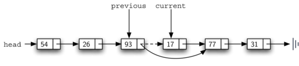

# Basic Data Structures
## Linear Structures
How items are added or removed distinguishes one linear structure from another

### Stacks
> The addition of new items and the removal of existing items always takes place at the same end

#### Properties
* TOP and BASE
* LIFO: last-in first-out


#### When to use
* Reverse the order of items
* Every web browser has a Back button. As you navigate from web page to web page, those pages are placed on a stack

#### Implementation
* `Stack()` creates a new stack that is empty. It needs no parameters and returns an empty stack.
* `push(item)` adds a new item to the top of the stack. It needs the item and returns nothing.
* `pop()` removes the top item from the stack. It needs no parameters and returns the item. The stack is modified.
* `peek()` returns the top item from the stack but does not remove it. It needs no parameters. The stack is not modified.
* `isEmpty()` tests to see whether the stack is empty. It needs no parameters and returns a boolean value.
* `size()` returns the number of items on the stack. It needs no parameters and returns an integer.

```python
class Stack:
     def __init__(self):
         self.items = []

     def isEmpty(self):
         return self.items == []

     def push(self, item):
         self.items.append(item)

     def pop(self):
         return self.items.pop()

     def peek(self):
         return self.items[len(self.items)-1]

     def size(self):
         return len(self.items)
```

#### Simple Balanced Parentheses
Balanced parentheses means that each opening symbol has a corresponding closing symbol and the pairs of parentheses are properly nested

Write a program to decide whether the symbols are balanced

##### Analyse
* the most recent opening parenthesis must match the next closing symbol
* the first opening symbol processed may have to wait until the very last symbol for its match


If a symbol is an opening parenthesis, push it on the stack as a signal that a corresponding closing symbol needs to appear later. If, on the other hand, a symbol is a closing parenthesis, pop the stack. As long as it is possible to pop the stack to match every closing symbol, the parentheses remain balanced. If at any time there is no opening symbol on the stack to match a closing symbol, the string is not balanced properly. At the end of the string, when all symbols have been processed, the stack should be empty. 

#### Balanced Symbols (A General Case)
The general problem of balancing and nesting different kinds of opening and closing symbols (`{[()]}`)

```python
from pythonds.basic.stack import Stack

def parChecker(symbolString):
    s = Stack()
    balanced = True
    index = 0
    while index < len(symbolString) and balanced:
        symbol = symbolString[index]
        if symbol in "([{":
            s.push(symbol)
        else:
            if s.isEmpty():
                balanced = False
            else:
                top = s.pop()
                if not matches(top,symbol):
                       balanced = False
        index = index + 1
    if balanced and s.isEmpty():
        return True
    else:
        return False

def matches(open,close):
    opens = "([{"
    closers = ")]}"
    return opens.index(open) == closers.index(close)


print(parChecker('{{([][])}()}'))
print(parChecker('[{()]'))
```

### Queues
> the addition of new items happens at one end, called the **rear**, and the removal of existing items occurs at the other end, commonly called the **front**. (think of a queue to buy tickets, new customer go to the rear of the queue)

#### Properties
* RARE and FRONT
* FIFO - first-in first-out / first-come first-served


#### When to use
* When students want to print, their print tasks “get in line” with all the other printing tasks that are waiting
* Operating systems use a number of different queues to control processes
* The keystrokes are being placed in a queue-like buffer so that they can eventually be displayed on the screen in the proper order

#### Implementation
* `Queue()` creates a new queue that is empty. It needs no parameters and returns an empty queue.
* `enqueue(item)` adds a new item to the rear of the queue. It needs the item and returns nothing.
* `dequeue()` removes the front item from the queue. It needs no parameters and returns the item. The queue is modified.
* `isEmpty()` tests to see whether the queue is empty. It needs no parameters and returns a boolean value.
* `size()` returns the number of items in the queue. It needs no parameters and returns an integer.

```python
class Queue:
    def __init__(self):
        self.items = []

    def isEmpty(self):
        return self.items == []

    def enqueue(self, item):
        self.items.insert(0,item)

    def dequeue(self):
        return self.items.pop()

    def size(self):
        return len(self.items)

```

#### Simulation: Hot Potato
In this game children line up in a circle and pass an item from neighbor to neighbor as fast as they can. At a certain point in the game, the action is stopped and the child who has the item (the potato) is removed from the circle. Play continues until only one child is left.

Upon passing the potato, the simulation will simply dequeue and then immediately enqueue that child. After num dequeue/enqueue operations, the child at the front will be removed permanently and another cycle will begin


```python
from pythonds.basic.queue import Queue

def hotPotato(namelist, num):
    simqueue = Queue()
    for name in namelist:
        simqueue.enqueue(name)

    while simqueue.size() > 1:
        for i in range(num):
            simqueue.enqueue(simqueue.dequeue())

        simqueue.dequeue()

    return simqueue.dequeue()

print(hotPotato(["Bill","David","Susan","Jane","Kent","Brad"],7))

```

### Deques


### Lists
> A collection of items where each item holds a relative position with respect to the others

#### Properties
* The list is a powerful, yet simple, collection mechanism that provides the programmer with a wide variety of operations. 

#### Implementation
* `List()` creates a new list that is empty. It needs no parameters and returns an empty list.
* `add(item)` adds a new item to the list. It needs the item and returns nothing. Assume the item is not already in the list.
* `remove(item)` removes the item from the list. It needs the item and modifies the list. Assume the item is present in the list.
* `search(item)` searches for the item in the list. It needs the item and returns a boolean value.
* `isEmpty()` tests to see whether the list is empty. It needs no parameters and returns a boolean value.
* `size()` returns the number of items in the list. It needs no parameters and returns an integer.
* `append(item)` adds a new item to the end of the list making it the last item in the collection. It needs the item and returns nothing. Assume the item is not already in the list.
* `index(item)` returns the position of item in the list. It needs the item and returns the index. Assume the item is in the list.
* `insert(pos, item)` adds a new item to the list at position pos. It needs the item and returns nothing. Assume the item is not already in the list and there are enough existing items to have position pos.
* `pop()` removes and returns the last item in the list. It needs nothing and returns an item. Assume the list has at least one item.
* `pop(pos)` removes and returns the item at position pos. It needs the position and returns the item. Assume the item is in the list.

**[Recursion]**

eg. get length recursively

* base case - is empty
* reduce the problem - suppose we already have a solution for the rest
* extend to the full problem
```
len(l)
  if isEmpty(l)
    return 0
  else
    return 1 + len(tail(l))
```

eg. find
```
find(x, l)
  if isEmpty(l)
    return false
  else
    if head(l) = x
      return true
    else
      return find(x, tail(l))
```

eg. total
```
total(l)
  if isEmpty(l)
    return 0
  else
    return head(l) + total(tail(l))
```

eg. max
[3, 1, 2]
```
max(l)
  if len(1)
    return head(l)
  else
    maxTail = max(tail(l))
    head = head(l)
    if head >= maxTail
      return head
    else
      return maxTail
```

##### Linked Lists
In order to implement an unordered list, we will construct what is commonly known as a **linked list**. Recall that we need to be sure that we can **maintain the relative positioning of the items**. However, there is **no requirement** that we maintain that positioning in **contiguous memory**. For example, consider the collection of items. It appears that these values have been placed randomly. If we can maintain some explicit information in each item, namely the location of the next item, then the relative position of each item can be expressed by simply following the link from one item to the next.


```python
class Node:
    def __init__(self,initdata):
        self.data = initdata
        self.next = None

    def getData(self):
        return self.data

    def getNext(self):
        return self.next

    def setData(self,newdata):
        self.data = newdata

    def setNext(self,newnext):
        self.next = newnext
```

Since this is sometimes referred to as “grounding the node,” we will use the standard ground symbol to denote a reference that is referring to None. It is always a good idea to explicitly assign None to your initial next reference values.


```python
class UnorderedList:

    def __init__(self):
        self.head = None
```

###### > isEmpty
```python
    def isEmpty(self):
        return self.head == None
```


An Empty List


A Linked List of Integers

###### > add
The easiest place to add the new node is right at the head, or beginning, of the list
```python
def add(self,item):
    temp = Node(item)
    temp.setNext(self.head)
    self.head = temp
```


###### > size
**linked list traversal**

````python
	
def size(self):
    current = self.head
    count = 0
    while current != None:
        count = count + 1
        current = current.getNext()

    return count
````


###### > search
```python
	
def search(self,item):
    current = self.head
    found = False
    while current != None and not found:
        if current.getData() == item:
            found = True
        else:
            current = current.getNext()

    return found
```


###### > remove
In order to remove the node containing the item, we need to modify the link in the previous node so that it refers to the node that comes after current. Unfortunately, there is no way to go backward in the linked list.  So we need a `previous`, it will always travel one node behind current

```python
	
def remove(self,item):
    current = self.head
    previous = None
    found = False
    while not found:
        if current.getData() == item:
            found = True
        else:
            previous = current
            current = current.getNext()

    if previous == None:
        self.head = current.getNext()
    else:
        previous.setNext(current.getNext())

```



Removing an Item from the Middle of the List


Removing the First Node from the List

###### > append
Remember that each of these must take into account whether the change is taking place at the head of the list or someplace else

# Recursion
Recursion is a method of solving problems that involves **breaking a problem down into smaller and smaller subproblems until you get to a small enough problem that it can be solved trivially**. Usually recursion involves a function calling itself. While it may not seem like much on the surface, recursion allows us to write elegant solutions to problems that may otherwise be very difficult to program.


# Algorithm Analysis
Whether one function is better than another

Consider computing resources
* The amount of space / memory required
* The amount of time required

We would like to have a characterization that is independent of the program or computer being used

## Big-O Notation
### Execution Time
Characterize an algorithm’s efficiency in terms of **execution time**, independent of any particular program or computer

If each of all **steps** is considered to be a **basic unit** of computation, then the **execution time** for an algorithm can be expressed as **the number of steps** required to solve the problem. 

`T(n)` is the time it takes to solve a problem of size `n`

Our goal then is to show how the algorithm’s execution time changes with respect to the size of the problem.

*eg.* $T(n)=1+n$

The order of magnitude function describes the part of `T(n)` that increases the fastest as the value of `n` increases

### Big-O
> Big-O notation (for “order”) and written as $O(f(n))$

It provides a useful approximation to the actual number of steps in the computation. The function `f(n)` provides a simple representation of the dominant part of the original `T(n)`.

*eg.* In the above example, $T(n)=1+n$. As n gets large, the constant `1` will become less and less significant to the final result. If we are looking for an approximation for `T(n)`, then we can drop the `1` and simply say that the running time is `O(n)`

*eg.* $T(n)=5n2+27n+1005$ -> `O(n2)`

#### Example
```python
a=5
b=6
c=10    // T(n) = 3
for i in range(n):
   for j in range(n):
      x = i * i
      y = j * j
      z = i * j    // T(n) += 3n^2
for k in range(n):
   w = a*k + 45
   v = b*b    // T(n) += 2n
d = 33    // T(n) += 1
```
$$T(n)=3+3n^2+2n+1$$
$$O(n^2)$$

### Best, worst and average case
Sometimes the performance of an algorithm depends on the exact values of the data rather than simply the size of the problem

We need to characterize their performance in terms of best case, worst case, or average case performance.

* best case - not that interesting
* worst case - most important
* maverage case - interesting, but often hard to do

### Common Big-O
| f(n)     |               Name        |
| -------- | ------------------------- |
| $1$      |               Constant    |
| $logn$   |               Logarithmic |	
| $n$      |               Linear      |	
| $nlog⁡n$ |               Log Linear  |	
| $n^2$    |               Quadratic   |	
| $n^3$    |               Cubic       |
| $2^n$    |               Exponential |


## Performance of Python Data Structures
### List
* most common operations were very fast
  * indexing - `O(1)`
  * assigning - `O(1)`
* performance of a less common operation was often sacrificed
  * append - `O(1)`
  * concat - `O(k)` (k is the size of the list that is being concatenated)


# Searching

Finding a particular item in a collection of items

## The Sequential Search
If each data item is stored in a position relative to others, we say that they have a linear or sequential relationship. Since these index values are ordered, it is possible for us to visit them in sequence. 

Starting at the first item in the list, we simply move from item to item, following the underlying sequential ordering until we either find what we are looking for or run out of items. 


```python

def sequentialSearch(alist, item):
    pos = 0
    found = False

    while pos < len(alist) and not found:
        if alist[pos] == item:
            found = True
        else:
            pos = pos+1

    return found
```

### Analysis of Sequential Search

#### 1. Not Ordered

We assume that the probability that the item we are looking for is in any particular position is exactly the same for each position of the list

Comparisons Used in a Sequential Search of an Unordered List
|Case|	Best Case|	Worst Case|	Average Case|
|----|	---------|	----------|	------------|
|item is present	|1	|n	|$n^2$|
|item is not present	|n|	n|	n|

If the item is not in the list, the only way to know it is to compare it against every item present. 

#### 2. Ordered

We assume that the list is ascending ordered 

if the item is not present there is a slight advantage

```python
def orderedSequentialSearch(alist, item):
    pos = 0
    found = False
    stop = False
    while pos < len(alist) and not found and not stop:
        if alist[pos] == item:
            found = True
        else:
            if alist[pos] > item:
                stop = True
            else:
                pos = pos+1

    return found
```

Comparisons Used in Sequential Search of an Ordered List
|Case|	Best Case|	Worst Case|	Average Case|
|----|	---------|	----------|	------------|
|item is present	|1	|n	|$n^2$|
|item is not present	|1	|n	|$n^2$|


## The Binary Search

Take greater advantage of the ordered list

A binary search will start by examining the **middle item**. 

If that item is the one we are searching for, we are done. 

If it is not the correct item, we can use the ordered nature of the list to **eliminate half** of the remaining items. 

If the item we are searching for is greater than the middle item, we know that the entire lower half of the list as well as the middle item can be eliminated from further consideration. The item, if it is in the list, must be in the upper half.


```python
def binarySearch(alist, item):
    first = 0
    last = len(alist)-1
    found = False
	
    while first<=last and not found:
        midpoint = (first + last)//2
            if alist[midpoint] == item:
                found = True
        else:
            if item < alist[midpoint]:
                last = midpoint-1
            else:
                first = midpoint+1

    return found
```
divide and conquer strategy - recursive version
```python
def binarySearch(alist, item):
    if len(alist) == 0:
        return False
    else:
        midpoint = len(alist)//2
        if alist[midpoint]==item:
            return True
        else:
            if item<alist[midpoint]:
                return binarySearch(alist[:midpoint],item)
            else:
                return binarySearch(alist[midpoint+1:],item)
```

### Analysis of Binary Search

Each comparison eliminates about half of the remaining items from consideration

|Comparisons	|Approximate Number of Items Left|
|-----------	|--------------------------------|
|1           	|          n/2                      |
| 2           	|         n/4                          |
| 3            	|                  n/8                    |
| ...           	|                  ...                    |
|  i            	|            $n/2^i = 1$                             |
When we split the list enough times, we end up with a list that has just one item
$$n/2^i = 1$$
$$i=logn$$

Therefore, the binary search is `O(logn)`.

**Note**: Even though a binary search is generally better than a sequential search, it is important to note that for small values of n, the additional cost of sorting is probably not worth it

If we can sort once and then search many times, the cost of the sort is not so significant. However, for large lists, sorting even once can be so expensive that simply performing a sequential search from the start may be the best choice.

# Sorting
## The Bubble Sort
It compares **adjacent** items and **exchanges** those that are **out of order**. Each item “bubbles” up to the location where it belongs

It makes multiple passes through a list. Each pass through the list places the next largest value in its proper place


At the start of the second pass, the largest value is now in place. There are n−1 items left to sort, meaning that there will be n−2 pairs. 


Swap
```
temp = alist[i]
alist[i] = alist[j]
alist[j] = temp
```
Swap in Python
```python
a,b = b,a
```

### Analysis of Bubble Sort

Since each pass places the next largest value in place, the total number of passes necessary will be n−1. After completing the **n−1 passes**, the smallest item must be in the correct position with no further processing required

|Pass	|Comparisons|
|----	|-----------|
|1    	|     n-1      |
|2   	|     n-2      |
|   3  	|      n-3        |
|   ...  	|      ...        |
|    n-1  	|         1        |

Sum them up: (n-1 + 1) * (n - 1) / 2 = $n^2/2 - n/2$
$$O(n^2)$$

**Note**: The **most inefficient** sorting method. However, because the bubble sort makes **passes through the entire unsorted portion** of the list, it has the capability to **do something** most sorting algorithms cannot. In particular, if during a pass there are **no exchanges**, then we know that the list must be **sorted**

### Bubble Short
A bubble sort can be modified to stop early if it finds that the list has become sorted

```python
def shortBubbleSort(alist):
    exchanges = True
    passnum = len(alist)-1
    while passnum > 0 and exchanges:
       exchanges = False
       for i in range(passnum):
           if alist[i]>alist[i+1]:
               exchanges = True
               temp = alist[i]
               alist[i] = alist[i+1]
               alist[i+1] = temp
       passnum = passnum-1
```

## The Selection Sort

Making only one exchange for every pass through the list

On each pass, the largest remaining item is selected and then placed in its proper location
1. Looks for the largest value as it makes a pass, after completing the pass, places it in the proper location
2. After the second pass, the next largest is in place

requires n−1 passes


```python
def selectionSort(alist):
   for fillslot in range(len(alist)-1,0,-1):
       positionOfMax=0
       for location in range(1,fillslot+1):
           if alist[location]>alist[positionOfMax]:
               positionOfMax = location

         temp = alist[fillslot]
       alist[fillslot] = alist[positionOfMax]
       alist[positionOfMax] = temp
```

## The Insertion Sort

The insertion sort, although still $O(n^2)$, works in a slightly different way. 
It always maintains a sorted sublist in the **lower positions** of the list

Each new item is then “inserted” back into the previous sublist such that the sorted sublist is one item larger. 


The following graph shows the fifth pass in detail. At this point in the algorithm, a sorted sublist of five items consisting of 17, 26, 54, 77, and 93 exists. We want to insert 31 back into the already sorted items. 


In general, a **shift** operation requires approximately **a third** of the processing work of an **exchange** since only one assignment is performed. In benchmark studies, insertion sort will show very good performance.

## The Merge Sort
divide and conquer strategy - recursive algorithm 

Continually splits a list in half

Merging is the process of taking two smaller sorted lists and combining them together into a single, sorted, new list


Splitting the List in a Merge Sort


Lists as They Are Merged Together

**Base case**: If the length of the list is less than or equal to one, then we already have a sorted list and no more processing is necessary

```python
def mergeSort(alist):
    print("Splitting ",alist)
    if len(alist)>1:
        mid = len(alist)//2
        lefthalf = alist[:mid]
        righthalf = alist[mid:]

        mergeSort(lefthalf)
        mergeSort(righthalf)

        i=0
        j=0
        k=0
        while i < len(lefthalf) and j < len(righthalf):
            if lefthalf[i] < righthalf[j]:
                alist[k]=lefthalf[i]
                i=i+1
            else:
                alist[k]=righthalf[j]
                j=j+1
            k=k+1

        while i < len(lefthalf):
            alist[k]=lefthalf[i]
            i=i+1
            k=k+1

        while j < len(righthalf):
            alist[k]=righthalf[j]
            j=j+1
            k=k+1
    print("Merging ",alist)
```

## The Quick Sort

divide and conquer

**not using additional storage**

1. A quick sort first selects a value, which is called the **pivot value** to assist with splitting the list. Although there are many different ways to choose the pivot value, we will simply use the first item in the list. 
2. 


