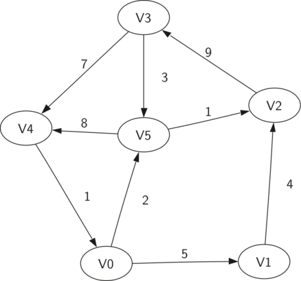
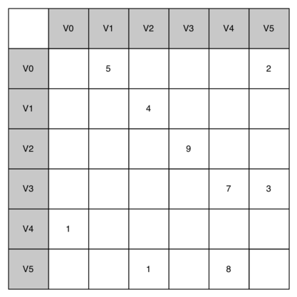

# Graph
A tree is a special kind of graph

## Vocabularies
* Vertex (Node)
* Edge (Arc) - An edge connects two vertices to show that there is a relationship between them. Edges may be **one-way** or **two-way**
* Directed graph (Digraph) - 
* Weight - Edges may be weighted to show that there is a cost to go from one vertex to another.
* Path - A path in a graph is a sequence of vertices that are connected by edges. 
* Cycle - A cycle in a directed graph is a path that starts and ends at the same vertex. 
* Acyclic graph - A graph with no cycles
* directed acyclic graph (DAG) - A directed graph with no cycles

 
## Operations
* `Graph()` - creates a new, empty graph.
* `addVertex(vert)` -  adds an instance of Vertex to the graph.
* `addEdge(fromVert, toVert)` - Adds a new, directed edge to the graph that connects two vertices.
* `addEdge(fromVert, toVert, weight)` - Adds a new, weighted, directed edge to the graph that connects two vertices.
* `getVertex(vertKey)` finds the vertex in the graph named vertKey.
* `getVertices()` returns the list of all vertices in the graph.
* `in` - returns True for a statement of the form vertex in graph, if the given vertex is in the graph, False otherwise.

## Implementation
There are two well-known implementations of a graph, the adjacency matrix and the adjacency list. 

### Adjacency Matrix
Each of the rows and columns represent a vertex in the graph

The value that is stored in the cell at the intersection of row v and column w indicates if there is an edge from vertex v to vertex w

A value in a cell represents the weight of the edge from vertex v to vertex w.

When two vertices are connected by an edge, we say that they are adjacent. 



The advantage of the adjacency matrix is that it is simple, and for small graphs it is easy to see which nodes are connected to other nodes. However, notice that most of the cells in the matrix are empty. Because most of the cells are empty we say that this matrix is “sparse.” A matrix is not a very efficient way to store sparse data. 

### Adjacency List
A more space-efficient way to implement a sparsely connected graph is to use an adjacency list

In an adjacency list implementation we keep a master list of all the vertices in the Graph object and then each vertex object in the graph maintains a list of the other vertices that it is connected to

The advantage of the adjacency list implementation is that it allows us to compactly represent a sparse graph. The adjacency list also allows us to easily find all the links that are directly connected to a particular vertex.

```python
class Vertex:
    def __init__(self,key):
        self.id = key
        self.connectedTo = {}

    def addNeighbor(self,nbr,weight=0):
        self.connectedTo[nbr] = weight

    def __str__(self):
        return str(self.id) + ' connectedTo: ' + str([x.id for x in self.connectedTo])

    def getConnections(self):
        return self.connectedTo.keys()

    def getId(self):
        return self.id

    def getWeight(self,nbr):
        return self.connectedTo[nbr]
```

```python
class Graph:
    def __init__(self):
        self.vertList = {}
        self.numVertices = 0

    def addVertex(self,key):
        self.numVertices = self.numVertices + 1
        newVertex = Vertex(key)
        self.vertList[key] = newVertex
        return newVertex

    def getVertex(self,n):
        if n in self.vertList:
            return self.vertList[n]
        else:
            return None

    def __contains__(self,n):
        return n in self.vertList

    def addEdge(self,f,t,cost=0):
        if f not in self.vertList:
            nv = self.addVertex(f)
        if t not in self.vertList:
            nv = self.addVertex(t)
        self.vertList[f].addNeighbor(self.vertList[t], cost)

    def getVertices(self):
        return self.vertList.keys()

    def __iter__(self):
        return iter(self.vertList.values())

```


