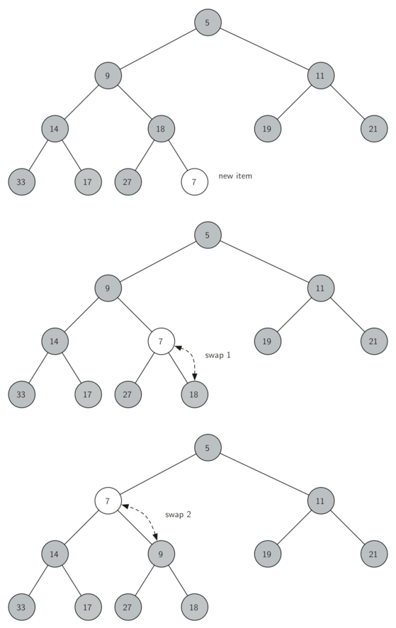

# Heaps

## Priority Queues
A priority queue acts like a queue in that you dequeue an item by removing it from the front. However, in a priority queue the logical order of items inside a queue is determined by their priority. The highest priority items are at the front of the queue and the lowest priority items are at the back. 

The classic way to implement a priority queue is using a data structure called a **binary heap**

A binary heap will allow us both enqueue and dequeue items in `O(logn)`.

## Variations
* **Min heap** - the smallest key is always at the front
* **Max heap** - the largest key value is always at the front

## Operations
* `BinaryHeap()` - creates a new, empty, binary heap.
* `insert(k)` - adds a new item to the heap.
* `findMin()` - returns the item with the minimum key value, leaving item in the heap.
* `delMin()` - returns the item with the minimum key value, removing the item from the heap.
* `isEmpty()` - returns true if the heap is empty, false otherwise.
* `size()` - returns the number of items in the heap.
* `buildHeap(list)` - builds a new heap from a list of keys.

## Properties
In order to guarantee logarithmic performance, we must keep our tree balanced

Keeping the tree balanced by creating a **complete binary tree** - each level has all of its nodes


<div style="text-align: center">A Complete Binary Tree</div>

Another interesting property of a complete tree is that we can represent it using a single list

Because the tree is complete, the left child of a parent (at position `p`) is the node that is found in position `2p` in the list. Similarly, the right child of the parent is at position `2p+1` in the list.

In a heap, for every node `x` with parent `p`, the key in `p` is smaller than or equal to the key in `x`.

We can compute the parent of any node by using simple integer division. The parent of the current node can be computed by dividing the index of the current node by 2.

## Implementation
### 1. Create
```python
class BinHeap:
    def __init__(self):
        self.heapList = [0]
        self.currentSize = 0
```

An empty binary heap has a single zero as the first element of heapList and that this zero is not used, but is there so that simple integer division can be used in later methods.

### 2. Insert



However, it is possible to write a method that will allow us to regain the heap structure property by comparing the newly added item with its parent. If the newly added item is less than its parent, then we can swap the item with its parent. 

```python
def insert(self,k):
    self.heapList.append(k)
    self.currentSize = self.currentSize + 1
    self.percUp(self.currentSize)
    
def percUp(self,i):
      while i // 2 > 0:  // has parent
      if self.heapList[i] < self.heapList[i // 2]:
         // swap
         tmp = self.heapList[i // 2]
         self.heapList[i // 2] = self.heapList[i]
         self.heapList[i] = tmp
      i = i // 2
```

### 3. Delete Min

Since the heap property requires that the root of the tree be the smallest item in the tree, finding the minimum item is easy. The hard part of `delMin` is restoring full compliance with the heap structure and heap order properties after the root has been removed.

First, we will restore the root item by taking the last item in the list and moving it to the root position.

Second, we will restore the heap order property by pushing the new root node down the tree to its proper position. 


```python
def percDown(self,i):
    while (i * 2) <= self.currentSize:
        mc = self.minChild(i)
        if self.heapList[i] > self.heapList[mc]:
            tmp = self.heapList[i]
            self.heapList[i] = self.heapList[mc]
            self.heapList[mc] = tmp
        i = mc

def minChild(self,i):
    if i * 2 + 1 > self.currentSize:
        return i * 2
    else:
        if self.heapList[i*2] < self.heapList[i*2+1]:
            return i * 2
        else:
            return i * 2 + 1
  
def delMin(self):
    retval = self.heapList[1]
    self.heapList[1] = self.heapList[self.currentSize]
    self.currentSize = self.currentSize - 1
    self.heapList.pop()
    self.percDown(1)
    return retval
```

### 4. Build heap


```python
def buildHeap(self,alist):
    i = len(alist) // 2
    self.currentSize = len(alist)
    self.heapList = [0] + alist[:]
    while (i > 0):
        self.percDown(i)
        i = i - 1
```


