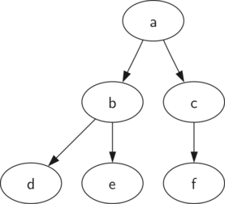
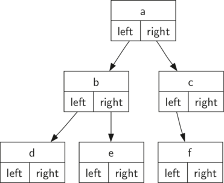
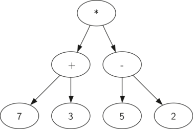
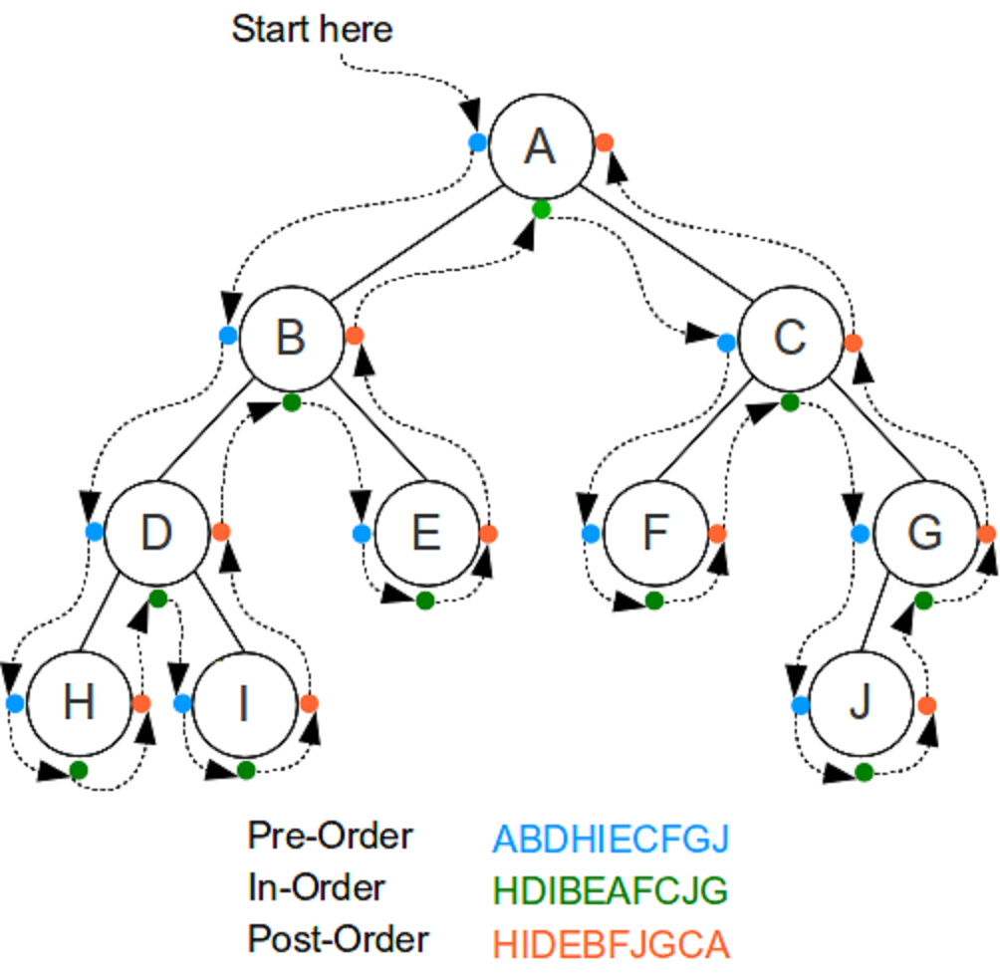
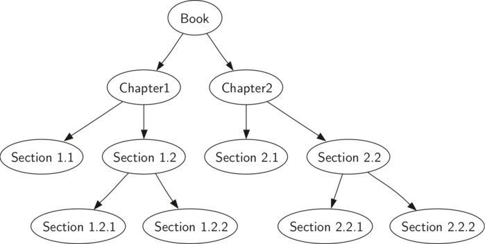
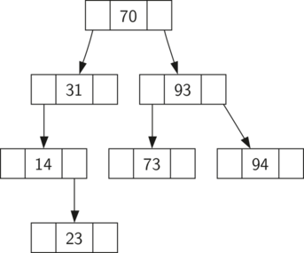
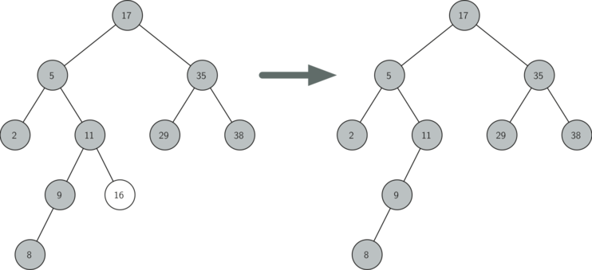
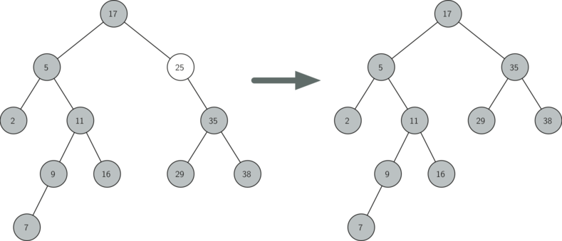
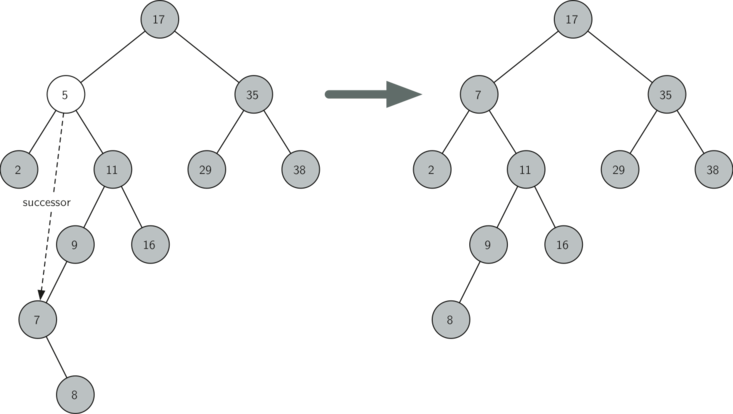
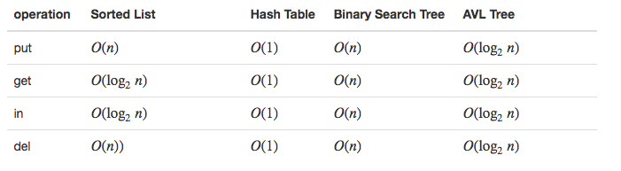

# Trees
## Properties
* Hierarchical - more general things near the top and the more specific things near the bottom
* All of the children of one node are independent of the children of another node
* Each leaf node is unique
* You can move entire sections of a tree (called a subtree) to a different position in the tree without affecting the lower levels of the hierarchy

## Vocabulary
* Node - A node is a fundamental part of a tree. It can have a name, which we call the `key`. A node may also have additional information. We call this additional information the `payload`. 
* Edge - An edge connects two nodes to show that there is a relationship between them. 
* Root - The only node in the tree that has no incoming edges
* Path - An ordered list of nodes that are connected by edges
* Children
* Parent
* Sibling
* Subtree - A set of nodes and edges comprised of a parent and all the descendants of that parent
* Leaf node - A leaf node is a node that has no children
* Level - The level of a node nn is the number of edges on the path from the root node to n.
* Height - The height of a tree is equal to the maximum level of any node in the tree
* **Binary Tree** - If each node in the tree has a maximum of two children, we say that the tree is a binary tree.
 
## Representation
### List

```
myTree = ['a',   #root
      ['b',  #left subtree
       ['d', [], []],
       ['e', [], []] ],
      ['c',  #right subtree
       ['f', [], []],
       [] ]
     ]
```

### Node and Reference
In this case we will define a class that has attributes for the root value, as well as the left and right subtrees



## Parse Tree


Parse trees can be used to represent real-world constructions like mathematical expressions

The hierarchy of the tree helps us understand the order of evaluation for the whole expression. Before we can evaluate the top-level multiplication, we must evaluate the addition and the subtraction in the subtrees. 

### Build the parse tree
The first step in building a parse tree is to break up the expression string into a list of **tokens**. There are four different kinds of tokens to consider: *left parentheses, right parentheses, operators, and operands*. We know that whenever we read a **left parenthesis** we are starting a new expression, and hence we should **create a new tree** to correspond to that expression. Conversely, whenever we read a right parenthesis, we have finished an expression. We also know that operands are going to be leaf nodes and children of their operators. Finally, we know that every operator is going to have both a left and a right child.

1. If the current token is a `(`, add a new node as the left child of the current node, and descend to the left child.
2. If the current token is in the list [`+`,`-`,`/`,`*`], set the root value of the current node to the operator represented by the current token. Add a new node as the right child of the current node and descend to the right child.
3. If the current token is a number, set the root value of the current node to the number and return to the parent.
4. If the current token is a `)`, go to the parent of the current node.

### Evaluate the parse tree
```python
def evaluate(parseTree):
    opers = {'+':operator.add, '-':operator.sub, '*':operator.mul, '/':operator.truediv}

    leftC = parseTree.getLeftChild()
    rightC = parseTree.getRightChild()

    if leftC and rightC:
        fn = opers[parseTree.getRootVal()]
        return fn(evaluate(leftC),evaluate(rightC))
    else:
        return parseTree.getRootVal()

```

## Tree Traversals
There are three commonly used patterns to visit all the nodes in a tree

The difference between these patterns is the order in which each node is visited. 

](algorithms-18.png)

### Preorder
In a preorder traversal, we visit the **root node first**, **then** recursively do a preorder traversal of the **left subtree**, **followed by** a recursive preorder traversal of the **right subtree**.



Suppose that you wanted to read this book from front to back. The preorder traversal gives you exactly that ordering

```python
def preorder(tree):
    if tree:
        print(tree.getRootVal())
        preorder(tree.getLeftChild())
        preorder(tree.getRightChild())
```
Implementing preorder as an **external function** is probably better in this case. The reason is that you very rarely want to just traverse the tree. In most cases you are going to want to **accomplish something else** while using one of the basic traversal patterns. 

### Inorder
In an inorder traversal, we recursively do an inorder traversal on the **left subtree**, visit the **root node**, and finally do a recursive inorder traversal of the **right subtree**.

```python
def inorder(tree):
  if tree != None:
      inorder(tree.getLeftChild())
      print(tree.getRootVal())
      inorder(tree.getRightChild())
```

Recover the fully parenthesized version of the expression
```python
def printexp(tree):
  sVal = ""
  if tree:
      sVal = '(' + printexp(tree.getLeftChild())
      sVal = sVal + str(tree.getRootVal())
      sVal = sVal + printexp(tree.getRightChild())+')'
  return sVal
```

### Postorder
In a postorder traversal, we recursively do a postorder traversal of the **left subtree** and the **right subtree** followed by a visit to the **root node**.

```python
def postorder(tree):
    if tree != None:
        postorder(tree.getLeftChild())
        postorder(tree.getRightChild())
        print(tree.getRootVal())
```

Evaluating a parse tree
```python
def postordereval(tree):
    opers = {'+':operator.add, '-':operator.sub, '*':operator.mul, '/':operator.truediv}
    res1 = None
    res2 = None
    if tree:
        res1 = postordereval(tree.getLeftChild())
        res2 = postordereval(tree.getRightChild())
        if res1 and res2:
            return opers[tree.getRootVal()](res1,res2)
        else:
            return tree.getRootVal()
```

## Binary Search Trees
Map from a key to a value

We are interested in using the binary tree structure to provide for efficient searching

* `Map()` Create a new, empty map.
* `put(key,val)` Add a new key-value pair to the map. If the key is already in the map then replace the old value with the new value.
* `get(key)` Given a key, return the value stored in the map or None otherwise.
* `del` Delete the key-value pair from the map using a statement of the form del map[key].
* `len()` Return the number of key-value pairs stored in the map.
* `in` Return True for a statement of the form key in map, if the given key is in the map.

### bst property
A binary search tree relies on the property that keys that are less than the parent are found in the left subtree, and keys that are greater than the parent are found in the right subtree

All of the keys in the left subtree are less than the key in the root. All of the keys in the right subtree are greater than the root.



### Tree Construction
```python
def put(self,key,val):
    if self.root:
        self._put(key,val,self.root)
    else:
        self.root = TreeNode(key,val)
    self.size = self.size + 1

def _put(self,key,val,currentNode):
    if key < currentNode.key:
        if currentNode.hasLeftChild():
               self._put(key,val,currentNode.leftChild)
        else:
               currentNode.leftChild = TreeNode(key,val,parent=currentNode)
    else:
        if currentNode.hasRightChild():
               self._put(key,val,currentNode.rightChild)
        else:
               currentNode.rightChild = TreeNode(key,val,parent=currentNode)
               
def __setitem__(self,k,v):
    self.put(k,v)
```

### Retrieval of a value for a given key
```python
def get(self,key):
    if self.root:
        res = self._get(key,self.root)
        if res:
               return res.payload
        else:
               return None
    else:
        return None

def _get(self,key,currentNode):
    if not currentNode:
        return None
    elif currentNode.key == key:
        return currentNode
    elif key < currentNode.key:
        return self._get(key,currentNode.leftChild)
    else:
        return self._get(key,currentNode.rightChild)

def __getitem__(self,key):
    return self.get(key)
```

### The deletion of a key
Once we’ve found the node containing the key we want to delete, there are three cases that we must consider:

#### The node to be deleted has no children


#### The node to be deleted has only one child

If a node has only a single child, then we can simply promote the child to take the place of its parent

There are six cases to consider. 

1. If the current node is a left child then we only need to update the parent reference of the left child to point to the parent of the current node, and then update the left child reference of the parent to point to the current node’s left child.
2. If the current node is a right child then we only need to update the parent reference of the right child to point to the parent of the current node, and then update the right child reference of the parent to point to the current node’s right child.
3. If the current node has no parent, it must be the root. In this case we will just replace the key, payload, leftChild, and rightChild data by calling the replaceNodeData method on the root.


#### The node to be deleted has two children


If a node has two children, then it is unlikely that we can simply promote one of them to take the node’s place. We can, however, search the tree for a node that can be used to replace the one scheduled for deletion. What we need is a node that will **preserve the binary search tree relationships** for both of the existing left and right subtrees. The node that will do this is the node that has the **next-largest key** in the tree. We call this node the **successor**

1. If the node has a right child, then the successor is the smallest key in the right subtree.
2. If the node has no right child and is the left child of its parent, then the parent is the successor.
3. If the node is the right child of its parent, and itself has no right child, then the successor to this node is the successor of its parent, excluding this node.

### Iteration
An iterator should return only one node each time the witerator is called.


## Analysis
The height of the tree is going to be around `log2n` where `n` is the number of nodes in the tree. This is because if the keys are randomly distributed, about half of them will be less than the root and half will be greater than the root.

The number of nodes at any particular level is $2^d$ where dd is the depth of the level

The total number of nodes in a perfectly balanced binary tree is $2^(h+1)−1$, where `h` represents the height of the tree.

In a balanced binary tree, the worst-case performance of put is $O(log2n)$, where `n` is the number of nodes in the tree



## Balanced Binary Search Trees