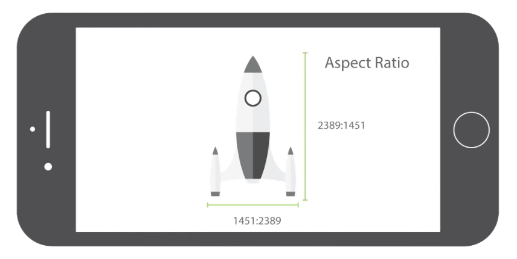
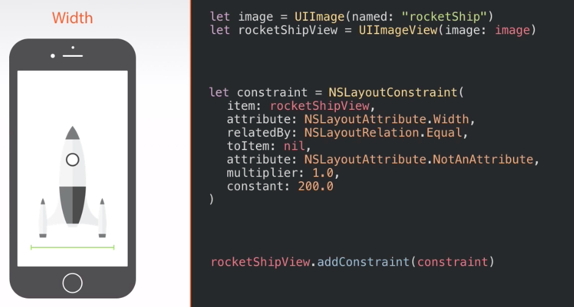

# Understanding Constraints, Relations and Priorities
## Common Constraints
### Top, Bottom, Leading and Trailing
The most common constraints are `top`, `bottom`, `leading` and `trailing`.

The `leading` and `trailing` will swap when it comes to right-to-left language but `left` and `right` will not.

### Center X, Center Y, Height and Width

### Aspect Ratio

### Baseline

## Key Components
1. Constant - number that defines the distance
2. Relation - `=`, `>=`, `<=`
3. Priority - 0 (lowest) ~ 1000 (required)

## How to Build Constraints
> Interface Builder >  Visual Format Language >  NSLayoutConstaint API
* Interface Builder - simple but not for unique, customized (formula, percentage)
* Visual Format Language - really flexible
* NSLayoutConstaint API - very hard

## Satisfying the Constraints
Your mission
> Finish the UI Design -> Satisfy the Constraints -> Think About Relationships

Give Auto Layout enough information to layout a set of  views

## Linear Equations

$$y = mx + b$$

At the low level, any constraint can be translate into NSLayoutConstraint object

# Diving into Interface Builder and NSLayoutConstraint

## Interface Builder
ImageView
1. Make it fit the aspect ratio (`command + =`)
2. Add an `Aspect Ratio` constraint
3. Add `Center X` and `Center Y` constraints
4. Add `Leading` and `Trailing` to margin (>= 20)

## NSLayoutConstraint
* Verbose (dict: more than necessary)
* Difficult to Master
* Flexible (formula, percentage)

* Add a constraint to the View - when it related to itself
* Add a constraint to the SuperView - when it related to another View in the same SuperView

## Menu Screen

It will look like this on an iPhone

Like this on an iPad

* Show distance between views - click a view, hold option key, move mouse
* ScrollView
  * Hide top bar in the attributes inspector of the view controller
  * Add top, bottom, leading and trailing 0 to container without margin (so that it can be transparent behind the navigation bar)
  * Add a ScrollView with 0 space to the whole screen
  * Set the top to container on the first item
  * Set vertical space between items
  * Set the bottom to container on the last item
  * Set leading and trailing on the first item
  * Set equal widths among all items

